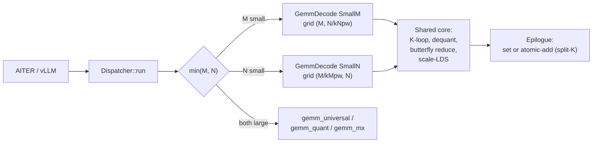
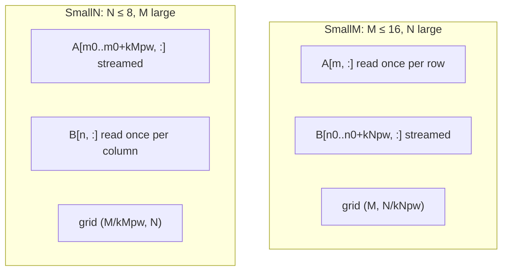
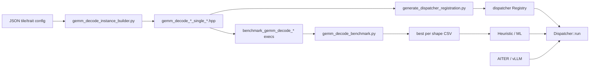
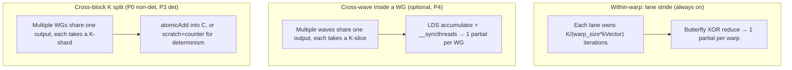

# GEMM Decode: Output-Centric Dense-GEMM Kernels for Small-Batch Decode

## 1. Overview

`gemm_decode` is a proposed new operator family in CK Tile that brings the warp-per-scalar, output-centric design proven for MoE decode (see `docs/warp_decode_design.md`) to **dense** GEMM workloads where one dimension of the problem is small. The target is the autoregressive decode step of LLM inference, where batch sizes are typically 1–32 and the activation tensor has shape `[M, K]` with `M ∈ {1, ..., 16}`.

Concretely, `gemm_decode` adds three kernels — `GemmDecodeUniversalKernel`, `GemmDecodeMxKernel`, `GemmDecodeBlockscaleKernel` — each available in two parallelism orientations (SmallM and SmallN), all sharing the warp-decode numeric helpers, scale-broadcast policies, and butterfly reduction primitive. The Universal kernel supports three scale subconfigurations through one template: **unscaled** (BF16/FP16 — replaces `wvSplitK`), **per-tensor FP8** with two FP32 scalars applied in the epilogue (FP8/FP8 — replaces `wvSplitKQ` and AITER `LLMM1`), and **per-token A + per-tensor B**. All variants support an optional bias vector, matching the `BIAS` argument of `wvSplitK*`.

The implementation lives in three sibling locations:

- **Kernel sources**: `include/ck_tile/ops/gemm_decode/`
- **Correctness**: `test/ck_tile/gemm_decode/` (GoogleTest)
- **Config sweep + benchmark + dispatcher registration**: `tile_engine/ops/gemm_decode/` and `dispatcher/codegen/`

The end goal is to **subsume** the hand-written HIP skinny-GEMM paths currently in `vllm/csrc/rocm/skinny_gemms.cu` (`wvSplitK`, `wvSplitKQ`, `wvSplitKrc`) and `aiter/csrc/kernels/custom_kernels.cu` (`wvSplitKQ`, `LLMM1`) behind a single CK Tile entry point routed through the dispatcher.

This document specifies the design, kernel architecture, integration points, and phasing. The companion plan tracking execution is in `~/.cursor/plans/gemm_decode_kernels_*.plan.md`.

---

## 2. Context: Where the Existing GEMM Family Falls Short

### 2.1 Tile granularity vs. decode batch size

CK Tile's universal, MX, and blockscale GEMM families are tiled around MFMA/WMMA warp tiles. The smallest legal `M_Tile` in the blockscale CK Tile path is **16** ([`aiter/csrc/ck_gemm_a8w8_blockscale/gemm_a8w8_blockscale_cktile_instance.py:131`](aiter/csrc/ck_gemm_a8w8_blockscale/gemm_a8w8_blockscale_cktile_instance.py)); the eight-waves policy raises that to **64** ([same file:147](aiter/csrc/ck_gemm_a8w8_blockscale/gemm_a8w8_blockscale_cktile_instance.py)). When the activation tensor is `[M, K]` with `M = 1..8`:

- The kernel reads a full MFMA-sized M slice (16, 32, or 64 rows) from global memory to compute one valid row.
- Padding overhead is 8× – 64× the useful work in the M dimension.
- Atomic split-K helps occupancy but does not recover the wasted M slice.
- LDS staging is sized for a full tile, dominating shared-memory budget.

### 2.2 The non-CK-Tile workarounds

Today, both vLLM and AITER plug this gap **outside CK Tile** with hand-written HIP:

| Kernel | Location | Supports | Internal convention |
|---|---|---|---|
| `wvSplitK` | [`vllm/csrc/rocm/skinny_gemms.cu:1177`](vllm/csrc/rocm/skinny_gemms.cu) | BF16/FP16 weights, N=1..4 | Small-N (in user view) |
| `wvSplitKQ` | [`vllm/csrc/rocm/skinny_gemms.cu:2241`](vllm/csrc/rocm/skinny_gemms.cu) | Per-tensor FP8 weights, N=1..4 | Small-N |
| `wvSplitKrc` | [`vllm/csrc/rocm/skinny_gemms.cu:1738`](vllm/csrc/rocm/skinny_gemms.cu) | gfx950 atomic-reduce variant, N up to 16 | Small-N |
| `wvSplitKQ` / `LLMM1` | `aiter/csrc/kernels/custom_kernels.cu` | Per-tensor FP8, BF16 | Small-N |

These kernels:

- Are pure HIP, hand-tuned per `(THRDS, YTILE, WvPrGrp, A_CHUNK, UNRL, N)` — no compile-time tile abstraction.
- Cover only narrow `(dtype, scale)` combinations. Notably, **none** of them support `1×128 / 128×128` blockscale (DeepSeek-V3) or e8m0 MX scales.
- Do not compose with CK Tile's pipeline/epilogue/split-K framework.
- Are dispatched by ad-hoc `if (M ≤ K && N ≤ 4) wvSplitK else hipBLASLt` ladders.

In their internal naming, `wvSplitK` uses "N" for the small dimension (the output column count), but in user-facing row-major GEMM convention this is the same workload as **small M**. We will design `gemm_decode` to cover both orientations and subsume these kernels.

### 2.3 Arithmetic intensity is the same as warp-decode

For small-M dense GEMM (`M=1, K=7168, N=4096`, FP8 weights):

```
FLOPs:   2 × M × N × K  =  2 × 1 × 4096 × 7168 ≈ 58.7 MFLOP
Bytes:   N × K × sizeof(W) + M × K × sizeof(X)
       = 4096 × 7168 × 1 + 1 × 7168 × 2
       = 29.4 MB
Arithmetic intensity ≈ 2 FLOP/byte
```

Modern AMD GPUs (MI300X/MI350X) deliver ~5–6 TB/s HBM and ~250+ TFLOP/s FP8 compute. The crossover is at ~40–50 FLOP/byte. At 2 FLOP/byte the kernel is **purely memory-bandwidth-bound** — exactly the regime where warp decode was shown to recover 1.84× over the traditional grouped-GEMM path (see `docs/warp_decode_design.md` §1).

---

## 3. Design: Warp-Per-Scalar Applied to Dense GEMM

### 3.1 Core principle

Each hardware wavefront independently computes **one output element** of `C[M, N]` (SmallM orientation) or **one row of the small N output** (SmallN orientation). The wavefront:

1. Streams one row of `A` and one row of `B^T` from global memory.
2. Multiplies and accumulates in FP32 registers, with each lane handling a `kVector`-wide strided subset of the `K` dimension.
3. Reduces across lanes via butterfly XOR shuffle.
4. Writes one (or `kMPerWarp`/`kNPerWarp`) scalar to `C`.

No LDS for the GEMM dot product. No MFMA. No sorting. Cross-wavefront synchronization is only needed when split-K is active, and is handled by the same atomic-add epilogue used in `gemm_quant_kernel.hpp` ([`rocm-libraries/projects/composablekernel/include/ck_tile/ops/gemm_quant/kernel/gemm_quant_kernel.hpp:407-541`](rocm-libraries/projects/composablekernel/include/ck_tile/ops/gemm_quant/kernel/gemm_quant_kernel.hpp)).

### 3.2 Why one warp per scalar makes sense for dense GEMM

The argument is identical to MoE warp decode (`docs/warp_decode_design.md` §6), with one simplification: there is **no expert routing**, so the wavefront's memory access pattern is fully contiguous. This makes the dense case strictly more cache- and L2-friendly than the MoE case at the same `(K, N)`. Concretely:

- Activation reuse: `A[m, :]` is read by every wavefront in row `m`. For `M=1`, the full activation row fits in L1/L2 and is loaded once across the GPU.
- Weight traffic: `B[n, :]` is read by exactly one wavefront. The total weight bytes streamed equals `N × K × sizeof(W)` — the irreducible minimum.
- Reduction: butterfly XOR shuffle, log₂(warp_size) instructions, no shared memory, no global barrier.

Expected sustained bandwidth: **≥ 75% of measured peak HBM** on gfx950, based on the warp-decode v2 profiling (`docs/warp_decode_optimization_v2.md`) where contiguous-access dense workloads sit consistently above the MoE 58% number reported in the original design doc.

### 3.3 Grid and block configuration

```
SmallM orientation (M ≤ 16, N large):
  grid  = (ceil(M / kMPerWarp), ceil(N / kNPerWarp))   # since A4
  block = (warp_size,)
  Each warp computes kMPerWarp × kNPerWarp output elements.

SmallN orientation (N ≤ 8, M large):
  grid  = (ceil(M / kMPerWarp), N)
  block = (warp_size,)
  Each warp computes kMPerWarp × 1 output elements.
```

`kMPerWarp` and `kNPerWarp` are template parameters in `Problem`. Typical values: 1, 2, 4. Larger values trade register pressure for less grid pressure and more reuse, and are part of the tunable space swept by `tile_engine/ops/gemm_decode/` (§7).

Split-K: optional second grid dimension `k_batch`, with atomic-add epilogue. Mirrors `gemm_quant_kernel.hpp` precisely — same `SplitKBatchOffset` pattern, same `KBatch = 2^splitK` exponent on the host side.

### 3.4 Architecture diagram



---

## 4. Kernel Variants

The three kernels share `Problem`/`Policy`/`Numeric` headers and differ only in their handling of the scale tensors. The K-loop body, lane layout, reduction, and epilogue are common.

### 4.1 `GemmDecodeUniversalKernel` (unscaled and per-tensor FP8)

`A: [M, K]` × `B: [N, K]` → `C: [M, N]`. One kernel template; the dtype × scale-layout combination selects three subconfigurations:

| Subconfig | A dtype | B dtype | `XScaleLayout` | `WScaleLayout` | Scale dtype | Subsumes |
|---|---|---|---|---|---|---|
| **Unscaled** | BF16 / FP16 | BF16 / FP16 | `void` | `void` | — | `wvSplitK` ([`skinny_gemms.cu:1177`](vllm/csrc/rocm/skinny_gemms.cu)) |
| **Per-tensor FP8** | FP8 (E4M3) | FP8 (E4M3) | `PerTensor` | `PerTensor` | `float` | `wvSplitKQ` ([`skinny_gemms.cu:2241`](vllm/csrc/rocm/skinny_gemms.cu)), AITER `wvSplitKQ`, `LLMM1` (FP8 path) |
| **Per-token A + per-tensor B** | FP8 | FP8 | `PerToken` | `PerTensor` | `float` | online-quantized activation path |

`Problem` carries:
- `ADataType`, `BDataType`, `AccDataType`, `CDataType`
- `XScaleDataType`, `WScaleDataType` (FP32 for these variants)
- `XScaleLayout`, `WScaleLayout` (from `GemmDecodeScaleLayout::{PerTensor, PerToken, void}`)
- `kVector` (lane chunk size, e.g., 8 for BF16, 16 for FP8)
- `kMPerWarp`, `kNPerWarp` (output tile per warp)
- `kUseDot2`, `kUsePackedFp32` (gfx9 numeric optimizations from warp-decode-moe)
- `kOutputAxis ∈ {SmallM, SmallN}`
- `kHasBias` (compile-time switch for the bias epilogue)

**Why per-tensor scales are essentially free at decode.** Per-tensor scales are loaded **once per workgroup** and applied **once in the epilogue** to the already-reduced scalar. Pseudo-code for the FP8 PerTensor SmallM kernel:

```
KERNEL gemm_decode_universal_smallM_pertensor_fp8:
  // Per-workgroup, loaded once
  if lane == 0:
      sA_local = *A_scale;          // single FP32 broadcast
      sB_local = *B_scale;
  sA = __shfl(sA_local, 0);          // wavefront broadcast, no LDS
  sB = __shfl(sB_local, 0);

  // K-loop: FP8×FP8 → FP32 accumulator, NO scale multiply inside
  acc = 0.0f
  for k = lane*kVector; k < K; k += warp_size*kVector:
      x_vec = load_vec<kVector, fp8>(A + m*K + k)
      w_vec = load_vec<kVector, fp8>(B + n*K + k)
      // dequant to FP32 via existing fp8x2_to_bf16x2 + bf16x2_to_f32x2 helpers
      // or via gfx9 dot2 with packed FP8 (kUseDot2=true)
      acc += dot_fp8(x_vec, w_vec)

  acc = wavefront_reduce_sum(acc)

  // Epilogue: scale + bias + cast
  if lane == 0:
      result = acc * sA * sB
      if (kHasBias) result += to_fp32(bias[n])
      C[m*N + n] = to_output(result)
```

This is bit-for-bit equivalent to `wvSplitKQ_hf_sml_`'s `result = sum * sA * sB` epilogue ([`skinny_gemms.cu:2210-2218`](vllm/csrc/rocm/skinny_gemms.cu)), but built from CK Tile primitives, so it composes with `IsSupportedArgument`, split-K, the dispatcher, and the tile_engine sweep framework.

**Bias.** Both `wvSplitK` and `wvSplitKQ` take an optional bias tensor (`BIAS` argument at [`skinny_gemms.cu:2199-2218`](vllm/csrc/rocm/skinny_gemms.cu)). `gemm_decode` exposes this via the compile-time `kHasBias` parameter on `Problem`. SmallM uses `bias[n]`, SmallN uses `bias[m]`. The bias add is the last operation in the epilogue, after scale.

**Why one kernel, not three.** All three subconfigurations share the K-loop, the wavefront reduce, the grid/block setup, and the dispatch path. The only difference is the dequant cost in the load and the scalar epilogue. Implementing them as `if constexpr` branches in one kernel keeps the codegen surface small and lets the tile_engine sweep one config tree per family.

This kernel is the direct CK Tile replacement for `wvSplitK` (unscaled BF16/FP16) **and** `wvSplitKQ` (per-tensor FP8) in [`vllm/csrc/rocm/skinny_gemms.cu`](vllm/csrc/rocm/skinny_gemms.cu), as well as AITER's `wvSplitKQ` and `LLMM1` in [`aiter/csrc/kernels/custom_kernels.cu`](aiter/csrc/kernels/custom_kernels.cu).

### 4.2 `GemmDecodeMxKernel` (e8m0 scales, 32-wide blocks)

Extends Universal with two `MXScalePointer<e8m0_t>` views, reusing [`rocm-libraries/projects/composablekernel/include/ck_tile/ops/gemm_mx/kernel/scale_pointer.hpp`](rocm-libraries/projects/composablekernel/include/ck_tile/ops/gemm_mx/kernel/scale_pointer.hpp). `ScaleBlockSize = 32`, i.e., one e8m0 scale per 32 K-elements — exactly the warp-decode "1D scale along K" case with `Block_N = 1`.

Inside the K-loop, the existing `__builtin_amdgcn_cvt_scalef32_pk_*` intrinsics handle dequant. These are already used in [`warp-decode-moe/projects/composablekernel/include/ck_tile/ops/warp_decode/kernel/warp_decode_numeric.hpp`](warp-decode-moe/projects/composablekernel/include/ck_tile/ops/warp_decode/kernel/warp_decode_numeric.hpp) and are lifted into `gemm_decode_numeric.hpp` unchanged. Validation reference: [`example/ck_tile/42_mx_gemm`](rocm-libraries/projects/composablekernel/example/ck_tile/42_mx_gemm).

Supported weight types: `pk_fp4_t` (MXFP4), `fp8_t` (MXFP8 OCP E4M3), `bf8_t` (MXBF8 OCP E5M2). All paired with `e8m0_t` scales.

### 4.3 `GemmDecodeBlockscaleKernel` (FP32 scales, 1×128 / 128×128 blocks)

The DeepSeek-V3 / a8w8 blockscale case. Uses `Block2D<Block_N, Block_K>` from the warp-decode scale-layout enum directly:

- `AQuantGroupSize = QuantGroupShape<sequence<1, 1, 128>>` — per-token, per-K-block (every 128 K-elements gets one FP32 scale).
- `BQuantGroupSize = QuantGroupShape<sequence<1, 128, 128>>` — 128×128 weight blocks share one scale.

This is identical to the layout used by [`aiter/csrc/ck_gemm_a8w8_blockscale/include/gemm_a8w8_blockscale_cktile_common.cuh:47-48`](aiter/csrc/ck_gemm_a8w8_blockscale/include/gemm_a8w8_blockscale_cktile_common.cuh).

Scale handling reuses two warp-decode primitives:

1. **`Block2D` traits** from [`warp_decode_problem.hpp:14`](warp-decode-moe/projects/composablekernel/include/ck_tile/ops/warp_decode/pipeline/warp_decode_problem.hpp).
2. **Per-workgroup scale LDS broadcast** (`WD-OPT-18`) from `WarpDecodeGateUpKernel`, which loads each scale once per workgroup into LDS and broadcasts to all warps. This produced a ~2.5% standalone win on dsv3 B=1 `gate_up_fp8` ([`docs/warp_decode_optimization_v2.md:224`](docs/warp_decode_optimization_v2.md)) and is the dominant scale-handling optimization at small M.

---

## 5. Two Orientations: SmallM and SmallN

Both orientations are the **same kernel** parameterized on `kOutputAxis ∈ { SmallM, SmallN }`. Only the grid layout and the per-warp output tile orientation differ; the K-loop body, scale loading, dequant, and wavefront reduction are bit-identical.



Why both: the autoregressive decode case (single token, large vocab/inter dim) is naturally **SmallM**. The vLLM `wvSplitK` case (BS=1, query projection where the output is e.g. `H = num_heads × head_dim` — and the kernel internally calls "N" what is rows in row-major view) is **SmallN**. The same kernel handles both by transposing the grid axis assignment.

SmallM lands in P0–P2 (universal, blockscale, MX). SmallN lands in P3 along with the head-to-head comparison against `wvSplitK` / `wvSplitKQ`.

---

## 6. Reuse from `ops/warp_decode/`

The warp-decode MoE work already paid the engineering cost for almost everything `gemm_decode` needs. The following components are lifted verbatim (or near-verbatim) into `include/ck_tile/ops/gemm_decode/`:

| Component | Source | Use in gemm_decode |
|---|---|---|
| `wavefront_reduce_sum` (butterfly XOR shuffle) | [`warp_decode_gate_up_kernel.hpp:162-172`](warp-decode-moe/projects/composablekernel/include/ck_tile/ops/warp_decode/kernel/warp_decode_gate_up_kernel.hpp) | Identical, copied into `gemm_decode_numeric.hpp` |
| `fp8x2_to_bf16x2`, `dot2_bf16_packed_add`, `pk_fma_f32`, `bf16x2_to_f32x2` | [`warp_decode_numeric.hpp`](warp-decode-moe/projects/composablekernel/include/ck_tile/ops/warp_decode/kernel/warp_decode_numeric.hpp) | Lifted unchanged |
| `MakeOutputTileDistribution`, `MakeXBroadcastTileDistribution` | [`warp_decode_policy.hpp:13-58`](warp-decode-moe/projects/composablekernel/include/ck_tile/ops/warp_decode/pipeline/warp_decode_policy.hpp) | Adapted for dense (no expert axis) |
| Per-workgroup scale LDS broadcast (WD-OPT-18) | `WarpDecodeGateUpKernel` | Applied in `GemmDecodeBlockscaleKernel` |
| Dual-buffer X-in-LDS staging (WD-OPT-21) | `WarpDecodeGateUpLdsXKernel` | Optional path for very large K |
| `WarpDecodeScaleLayout::{PerTensor, PerToken, Block2D<...>}` | [`warp_decode_problem.hpp:11-36`](warp-decode-moe/projects/composablekernel/include/ck_tile/ops/warp_decode/pipeline/warp_decode_problem.hpp) | Reused as `GemmDecodeScaleLayout` |

This is the single most important reason `gemm_decode` is feasible in a few weeks rather than months: the warp-decode v2 optimization roadmap (`docs/warp_decode_optimization_v2.md`) already converged on the numerics and the scale-LDS pattern that need to apply here.

---

## 7. Where It Lives, and How It Builds

### 7.1 Directory layout

```
include/ck_tile/ops/gemm_decode/                  # kernel sources
├── gemm_decode.hpp                               # facade, mirrors ops/warp_decode.hpp
├── kernel/
│   ├── gemm_decode_universal_kernel.hpp
│   ├── gemm_decode_mx_kernel.hpp
│   ├── gemm_decode_blockscale_kernel.hpp
│   └── gemm_decode_numeric.hpp                   # dot2 / pk_fma / fp8x2_to_bf16x2 helpers
└── pipeline/
    ├── gemm_decode_problem.hpp                   # GemmDecodeProblem<...> traits
    └── gemm_decode_policy.hpp                    # MakeXBroadcastTileDistribution etc.

test/ck_tile/gemm_decode/                         # correctness only
├── CMakeLists.txt
└── test_gemm_decode.cpp

tile_engine/ops/gemm_decode/                      # config sweeps + benchmarks
├── CMakeLists.txt
├── gemm_decode_common.hpp
├── gemm_decode_benchmark.hpp
├── gemm_decode_profiler.hpp
├── gemm_decode_instance_builder.py
├── gemm_decode_benchmark.py
├── gemm_decode_validation_utils.py
├── configs/
│   ├── default_config.json
│   ├── decode_skinny_compare.json
│   └── decode_blockscale_dsv3.json
├── universal/
│   ├── CMakeLists.txt
│   └── gemm_decode_universal_benchmark_single.cpp
├── mx/
│   ├── CMakeLists.txt
│   └── gemm_decode_mx_benchmark_single.cpp
└── blockscale/
    ├── CMakeLists.txt
    └── gemm_decode_blockscale_benchmark_single.cpp
```

The kernel-layer choice (`dedicated_dir`, `ops/gemm_decode/`) was confirmed explicitly. It mirrors `ops/warp_decode/` so the numeric helpers, LDS-staging, scale-broadcast, and reduction code can be lifted in essentially unchanged form. Per-family kernels stay in single files (~300 lines each, like [`warp_decode_gate_up_kernel.hpp`](warp-decode-moe/projects/composablekernel/include/ck_tile/ops/warp_decode/kernel/warp_decode_gate_up_kernel.hpp)) and share their guts via `gemm_decode_numeric.hpp` + the common policy.

### 7.2 Tests: correctness only

`test/ck_tile/gemm_decode/test_gemm_decode.cpp` is GoogleTest, wired through `add_gtest_executable` — same pattern as [`test/ck_tile/warp_decode/CMakeLists.txt`](warp-decode-moe/projects/composablekernel/test/ck_tile/warp_decode/CMakeLists.txt). One fixed matrix:

- **Universal — unscaled**: BF16/BF16, FP16/FP16. Bias on / off. Subsumes `wvSplitK`.
- **Universal — per-tensor FP8**: FP8/FP8 with two FP32 scalars (`PerTensor × PerTensor`). Bias on / off. Subsumes `wvSplitKQ` and AITER `LLMM1`.
- **Universal — per-token A + per-tensor B**: FP8/FP8 with `PerToken` A scale and `PerTensor` B scale. Bias on / off. Online-quantized-activation path.
- **MX**: BF16/MXFP4, BF16/MXFP8, BF16/MXBF8 with `e8m0_t` scales, `ScaleBlockSize=32`.
- **Blockscale**: FP8/FP8 with `1×128` × `128×128` (DeepSeek-V3), FP8/FP8 with `1×128` × `1×128` (per-token-per-block).
- Both orientations (SmallM, SmallN), several `k_batch` values.
- Negative coverage: null pointers, non-divisible `K`, invalid strides, mismatched orientation, scale-pointer null when scale layout requires one.

Reference compute is FP32, executed on host. Per-tensor scaled cases multiply by `sA * sB` after the FP32 dot; bias is added last. No performance assertions here — that's the tile_engine's job.

### 7.3 Tile_engine: config sweeps and benchmarking

Benchmarking is **not** a single `bench_gemm_decode.cpp` (as warp-decode-moe used). Instead, it follows the per-kernel-executable model already proven for `gemm_universal`, documented in [`tile_engine/ops/gemm/README.md`](rocm-libraries/projects/composablekernel/tile_engine/ops/gemm/README.md). This was the key correction during planning.

**How a kernel becomes an executable:**

1. `configs/default_config.json` declares the tile × trait cross-product for that family. The schema extends the existing `tile_config` with decode-specific fields:

   ```json
   {
     "tile_config": {
       "tile_m": {"values": [1, 2, 4, 8, 16]},
       "tile_n": {"values": [32, 64, 128]},
       "tile_k": {"values": [128, 256]},
       "m_per_warp": {"values": [1, 2, 4]},
       "n_per_warp": {"values": [1, 2, 4]},
       "vector_size": {"values": [8, 16]},
       "lanes_per_output": {"values": [64]},
       "output_axis": {"values": ["smallM", "smallN"]},
       "use_dot2": {"values": [true, false]},
       "use_packed_fp32": {"values": [true, false]}
     },
     "trait_config": {
       "pipeline": {"values": ["decode"]},
       "scheduler": {"values": ["intrawave"]},
       "epilogue": {"values": ["default", "atomic_add"]},
       "split_k": {"values": [1, 2, 4, 8]},
       "pad_k": {"values": [false]},
       "persistent": {"values": [false]}
     }
   }
   ```

2. `gemm_decode_instance_builder.py` walks the cross-product and calls `gemm_decode_validation_utils.py` to prune invalid combinations:
   - `K % (warp_size × vector_size) == 0`
   - `M % m_per_warp == 0` (SmallM) or `N % n_per_warp == 0` (SmallN)
   - `Block2D` divisibility on M, N, K, Block_N, Block_K
   - LDS budget within gfx950's effective cap; warp-decode v2 settled at ≤ 48–52 KiB for good occupancy ([`docs/warp_decode_optimization_v2.md:205`](docs/warp_decode_optimization_v2.md)).

3. Each surviving combination produces a `gemm_decode_<family>_single_<...>.hpp` instantiation header and a matching `add_executable(EXCLUDE_FROM_ALL ...)` target named:

   ```
   benchmark_gemm_decode_<family>_<dtype>_<layout>_<orientation>_<traits>_<tiles>
   ```

   These thread into collection targets (`benchmark_gemm_decode_universal_all`, `..._<dtype>`, `..._<layout>`, `..._<orientation>`) — mirroring [`tile_engine/ops/gemm/gemm_universal/CMakeLists.txt:266`](rocm-libraries/projects/composablekernel/tile_engine/ops/gemm/gemm_universal/CMakeLists.txt).

4. Each executable embeds one instantiation and uses the same profiler wrapper pattern as `gemm_universal_benchmark_single.cpp`:

   ```cpp
   auto kernel_func = [](const ck_tile::GemmDecodeHostArgs& args,
                         const ck_tile::stream_config& s) {
       return SelectedKernel::launch(args, s);
   };
   profiler.benchmark(gemm_decode_problem, kernel_func);
   profiler.select_best_instance(static_cast<Metric>(arg_parser.get_int("metric")));
   ```

5. `gemm_decode_benchmark.py` is the Python sweep driver. It discovers all `benchmark_gemm_decode_*` execs in `build/bin/`, runs each across `--problem-sizes`, `--split-k`, and `--orientation`, and emits a CSV. It mirrors [`tile_engine/ops/gemm/gemm_universal/gemm_universal_benchmark.py`](rocm-libraries/projects/composablekernel/tile_engine/ops/gemm/gemm_universal/gemm_universal_benchmark.py).

**Decode-specific config files:**

- `configs/decode_skinny_compare.json` — vLLM `wvSplitK` / `wvSplitKQ` shapes (Llama-3-70B, Mistral, etc.) for head-to-head P3 comparison.
- `configs/decode_blockscale_dsv3.json` — DeepSeek-V3 a8w8_blockscale shapes from `docs/blockscale-gemm-reference.md`.

This is also the harness that drives `rocprofv3` profiling for gfx950 (256 CUs, 8 XCDs) — same methodology as `docs/rocprofv3-kernel-profiling-methodology.md` and `docs/warp_decode_optimization_v2.md`.

The decode op is added to [`tile_engine/operation_support_matrix.md`](rocm-libraries/projects/composablekernel/tile_engine/operation_support_matrix.md) as a new row alongside `gemm_universal`, `gemm_preshuffle`, and `streamk_gemm`.

### 7.4 Default CLI

All decode benchmark executables inherit the existing tile_engine CLI:

```
-m=<M>            -n=<N>            -k=<K>
-stride_a=<...>   -stride_b=<...>   -stride_c=<...>
-verify=<0|1|2>   -warmup=<int>     -repeat=<int>
-timer=<true|false>  -flush_cache=<true|false>
-init=<0|1|2>     -log=<true|false>
-metric=<0|1|2>   -json_output=<true|false>
-csv_filename=<f> -csv_format=<simple|comprehensive>
-split_k=<int>    -pipeline=decode  -scheduler=intrawave
-epilogue=<default|atomic_add>
-pad_k=<true|false>
```

Full reference: [`tile_engine/ops/gemm/README.md:284`](rocm-libraries/projects/composablekernel/tile_engine/ops/gemm/README.md).

---

## 8. Dispatcher Integration

The CK Tile [`dispatcher/`](rocm-libraries/projects/composablekernel/dispatcher/) provides `Registry` + `KernelInstance` + `Problem` + `Dispatcher` ([`dispatcher/include/ck_tile/dispatcher/dispatcher.hpp:36-77`](rocm-libraries/projects/composablekernel/dispatcher/include/ck_tile/dispatcher/dispatcher.hpp)) — a runtime routing layer that picks the best kernel for a `Problem(M, N, K, ...)` from a registered set. `gemm_decode` plugs in here rather than introducing a parallel dispatch system in AITER or vLLM.

### 8.1 Registration

The dispatcher already consumes tile_engine-generated kernel headers via `dispatcher/codegen/generate_dispatcher_registration.py`, which emits one `register_kernel(make_shared<TileKernelInstance<...>>(...))` per kernel header. We extend that script to also walk `tile_engine/ops/gemm_decode/{universal,mx,blockscale}/` outputs.

Each decode kernel becomes a `KernelInstance` (interface at [`dispatcher/include/ck_tile/dispatcher/kernel_instance.hpp:17`](rocm-libraries/projects/composablekernel/dispatcher/include/ck_tile/dispatcher/kernel_instance.hpp)) whose `supports(Problem)` mirrors `IsSupportedArgument`:

- M/N divisibility by `m_per_warp` / `n_per_warp`
- K divisibility by `warp_size × vector_size`
- Block2D divisibility for blockscale variants
- Scale-block-size match for MX variants
- Optional M/N upper bound (e.g., `M ≤ 16` for SmallM kernels)

### 8.2 Heuristic for decode vs. full-size

The dispatcher's `HeuristicFunction` (see [`dispatcher.hpp:36`](rocm-libraries/projects/composablekernel/dispatcher/include/ck_tile/dispatcher/dispatcher.hpp)) is the right hook for the SmallM/SmallN gate. A simple version:

```cpp
auto decode_heuristic = [](const Problem& p) -> std::vector<std::string> {
    constexpr int DECODE_M_THR = 16;
    constexpr int DECODE_N_THR = 8;
    std::vector<std::string> ranked;
    if (p.M <= DECODE_M_THR) {
        ranked = registry.filter_by_family("gemm_decode_smallM");
    } else if (p.N <= DECODE_N_THR) {
        ranked = registry.filter_by_family("gemm_decode_smallN");
    } else {
        ranked = registry.filter_by_family("gemm_universal");
    }
    return ranked;
};
dispatcher.set_heuristic(decode_heuristic);
dispatcher.set_strategy(SelectionStrategy::Heuristic);
```

This replaces the bespoke `if (M ≤ K) wvSplitK else hipBLASLt` ladder in [`vllm/csrc/rocm/skinny_gemms.cu`](vllm/csrc/rocm/skinny_gemms.cu).

### 8.3 ML heuristic path (optional)

`dispatcher/heuristics/` already has a LightGBM-based selector ([`dispatcher/README.md:203`](rocm-libraries/projects/composablekernel/dispatcher/README.md)). The CSV output from `gemm_decode_benchmark.py` is in the same format the heuristic trainer consumes — landing decode kernels in the dispatcher means they're picked up by the same auto-tuning pipeline that already covers `gemm_universal`.

### 8.4 End-to-end flow



The CSV-to-heuristic path closes the loop: the same per-shape benchmarks that prove a tile config feed the runtime selector. There is no separate `best_kernels.txt` → AITER lookup table to maintain.

---

## 9. Detailed Pseudo-Code

### 9.1 Notation

```
M, N, K           Problem dimensions
warp_size         32 (gfx12) or 64 (gfx9)
kVector           Lane chunk size along K
kMPerWarp         Output rows per warp (B-reuse; >1 in SmallM since A4)
kNPerWarp         Output cols per warp (A-reuse; SmallM orientation)
A[M, K]           Activation (row-major)
B[N, K]           Weight (row-major; each row is one output column of B^T)
C[M, N]           Output (row-major)
```

For brevity, the pseudo-code below shows the SmallM, no-quant case. SmallN swaps grid axes; quant variants add scale loads inline.

### 9.2 Universal SmallM kernel

```
KERNEL gemm_decode_universal_smallM:
  Grid:  (ceil(M / kMPerWarp), ceil(N / kNPerWarp))   # A4: 2D register tile
  Block: (warp_size,)

  m_base  = blockIdx.x * kMPerWarp
  n_base  = blockIdx.y * kNPerWarp
  lane    = threadIdx.x

  // ---- kMPerWarp x kNPerWarp output accumulators (in registers) ----
  acc[0 .. kMPerWarp*kNPerWarp - 1] = 0.0f

  // ---- K-loop: lane-strided, vectorized ----
  for k_start in range(0, K, warp_size * kVector):
      k = k_start + lane * kVector

      // Load kVector elements of each of the kMPerWarp A rows once.
      // Tail rows (m_base+im >= M) clamp to M-1; masked out at store.
      for im in 0..kMPerWarp-1:
          x_vec[im] = load_vec<kVector>(A + min(m_base+im, M-1) * K + k)

      // Each B row is loaded once and reused across all kMPerWarp A rows
      // held in registers -- the B-reuse win (drops B traffic to ~N*K).
      for j in 0..kNPerWarp-1:
          n     = n_base + j
          w_vec = load_vec<kVector>(B + n * K + k)
          w_f   = to_fp32_vec(w_vec)          // inline dequant (FP8 -> BF16x2)
          for im in 0..kMPerWarp-1:
              x_f = to_fp32_vec(x_vec[im])
              for v in 0..kVector-1:
                  acc[im*kNPerWarp + j] += x_f[v] * w_f[v]

  // ---- Wavefront reduction (butterfly XOR shuffle) ----
  for i in 0..kMPerWarp*kNPerWarp-1:
      acc[i] = wavefront_reduce_sum(acc[i])

  // ---- Epilogue (masked tail rows) ----
  if lane == 0:
      for im in 0..kMPerWarp-1:
          m = m_base + im
          if m >= M: continue               // tail-block mask
          for j in 0..kNPerWarp-1:
              n = n_base + j
              if n < N:
                  if epilogue == set:
                      C[m * N + n] = to_output(acc[im*kNPerWarp + j])
                  else:  // atomic_add for split-K
                      atomicAdd(C + m * N + n, to_output(acc[im*kNPerWarp + j]))
```

The kernel is ~250 lines in real CK Tile code (counting all variant-specific compile-time branches).

### 9.3 Blockscale variant: scale load and LDS broadcast

The blockscale K-loop differs only in the scale handling:

```
KERNEL gemm_decode_blockscale_smallM:
  // ---- Per-workgroup setup ----
  // Load this workgroup's A scales once into LDS (WD-OPT-18 pattern)
  __shared__ float a_scale_lds[K / Block_K];
  cooperative_load_a_scales(a_scale_lds, A_scale + m * (K / Block_K), K / Block_K)
  __syncthreads()

  // K-loop now has scaled dequant:
  for k_block in range(0, K / Block_K):
      a_scale = a_scale_lds[k_block]
      // B scale: 128x128 block, one float per Block_K × Block_N tile
      b_scale = B_scale[n / Block_N + (k_block / (Block_K / Block_K)) * (N / Block_N)]

      for k_inner_start in range(0, Block_K, warp_size * kVector):
          // ... same vector load + dot product as universal, but multiply by a_scale * b_scale
          acc[j] += a_scale * b_scale * (x_f[v] * w_f[v])
```

The scale-LDS hoisting is what `WD-OPT-18` proved out: at small M, the A-scale tensor is tiny (one float per K-block per token row) and loading it once per workgroup, broadcast via LDS, avoids the redundant global loads each warp would otherwise issue.

### 9.4 MX variant: e8m0 dequant via intrinsic

The MX K-loop is the only one that diverges materially because it uses the dedicated `__builtin_amdgcn_cvt_scalef32_pk_*` intrinsics (gfx95+). One iteration looks like:

```
for k_start in range(0, K, warp_size * kVector):
    k = k_start + lane * kVector

    // Load packed weights (e.g., 16 FP4 values as a 64-bit word)
    w_packed = load_u64(B + n * K_bytes + k_bytes)

    // Load 1 e8m0 scale per 32 K-elements
    e8m0 wscale = B_scale[n * (K / 32) + (k / 32)]
    e8m0 xscale = A_scale[m * (K / 32) + (k / 32)]

    // Single intrinsic: unpack + dequant + scale, returns 2 BF16 packed in a u32
    bf16x2 dq[8] = __builtin_amdgcn_cvt_scalef32_pk_bf16_fp4(w_packed, wscale, xscale)

    // Accumulate (uses pk_fma if kUsePackedFp32, dot2 otherwise)
    for p in 0..7:
        acc[j] = pk_fma_f32(acc[j], x_packed[p], dq[p])
```

This logic is already in [`warp_decode_numeric.hpp`](warp-decode-moe/projects/composablekernel/include/ck_tile/ops/warp_decode/kernel/warp_decode_numeric.hpp); `gemm_decode_numeric.hpp` is a copy with the MoE-specific bits stripped.

---

## 10. Split-K Strategies and `IsSupportedArgument`

Decode workloads frequently leave a substantial fraction of CUs idle when the grid is `(M, N/kNPerWarp)` or `(M/kMPerWarp, N)` and one of those dimensions is small. vLLM's `wvSplitKrc` ([`skinny_gemms.cu:1738`](vllm/csrc/rocm/skinny_gemms.cu)) addresses exactly this by introducing a **cross-block K split** on gfx950. We adopt the same idea, plus two more axes (cross-wave reuse, within-warp lane stride) that together cover the full design space.

### 10.1 Three axes of K parallelism



**Axis 1 — within-warp lane stride** is the warp-decode primitive itself: each lane in a wavefront handles `K / (warp_size × kVector)` K-elements, the warp reduces via `wavefront_reduce_sum`. Always on, no template flag.

**Axis 2 — cross-block K split**. Same idea as `gemm_quant_kernel.hpp`'s `SplitKBatchOffset` pattern ([`rocm-libraries/projects/composablekernel/include/ck_tile/ops/gemm_quant/kernel/gemm_quant_kernel.hpp:407-541`](rocm-libraries/projects/composablekernel/include/ck_tile/ops/gemm_quant/kernel/gemm_quant_kernel.hpp)), modulo determinism. Two epilogue modes:

- **Non-deterministic** (`SplitKMode::AtomicAdd`): each K-shard does `atomicAdd(C[m, n], partial)`. Cheap, one extra instruction per output. Matches `wvSplitKrc_`'s `DTRMNSTC=0` path ([`skinny_gemms.cu:1628-1631`](vllm/csrc/rocm/skinny_gemms.cu)).

- **Deterministic** (`SplitKMode::ScratchReduce`): each K-shard writes its partial to a per-shard slot in a global scratch tensor, increments a per-output counter, and the last shard reads back all partials and reduces in registers / LDS. Bit-reproducible across runs. Matches `wvSplitKrc_`'s `DTRMNSTC=1` path ([`skinny_gemms.cu:1620-1627, 1651-1680`](vllm/csrc/rocm/skinny_gemms.cu)). Required for vLLM's batch-invariant inference mode.

  The scratch + counter pattern needs three things from the host side: (1) a pre-allocated FP32 scratch tensor sized `k_batch × M × N`, (2) a pre-allocated int counter tensor sized `M × N` (or coarser, per `kNPerWarp` tile), (3) a one-time zero-init of the counter at the start of each invocation (or per-output `__hip_atomic_store(0)` from the K=0 shard, as `wvSplitKrc_` does at lines 1404 and 1446).

The cross-block K split should kick in when `grid_M × grid_N × k_batch ≤ CuCount`, i.e. when the grid still under-occupies the GPU. `wvSplitKrc` decides this on the host with `rndup_cus = ceil(M / 64) × ceil(K / 512); CuNeeded = rndup_cus × GrpsShrB` ([`skinny_gemms.cu:1777-1787`](vllm/csrc/rocm/skinny_gemms.cu)). We expose `k_batch` as an explicit `Problem` parameter (matching `gemm_quant`'s `k_batch`) and let the tile_engine sweep + dispatcher heuristic pick the value.

**Axis 3 — cross-wave reuse inside a WG**. Several waves in a WG collaborate so that the *shared operand* (activation row for SmallM, weight column for SmallN) is loaded once into LDS and broadcast. This is the `GrpsShrB` mechanism in `wvSplitKrc_` ([`skinny_gemms.cu:1372-1378`](vllm/csrc/rocm/skinny_gemms.cu)) and the direct analogue of warp-decode v2's `WD-OPT-21` X-in-LDS dual-buffer staging. Optional; lands in P4 as an optimization once the baseline is profiled. The trigger is high WG occupancy (many waves per CU) combined with a hot shared operand.

### 10.2 `Problem` parameters for split-K

```cpp
struct GemmDecodeProblem {
    // ... dtype, layout, scale-layout, kVector, kMPerWarp, kNPerWarp, kOutputAxis, kHasBias ...

    static constexpr index_t k_batch          = K_BATCH;        // 1 disables split-K
    using SplitKMode                          = AtomicAdd;       // or ScratchReduce
    static constexpr bool     k_split_cross_wave = false;        // axis 3, P4 optimization
    static constexpr index_t  waves_per_wg     = 1;              // 1 = one warp per output; >1 = cross-wave reuse
};
```

### 10.3 `IsSupportedArgument` checks

The host facade `gemm_decode.hpp` exposes `launch_gemm_decode_*<Kernel>(args, stream_config)` — same shape as `launch_warp_decode_gate_up` at [`ops/warp_decode.hpp:17`](warp-decode-moe/projects/composablekernel/include/ck_tile/ops/warp_decode.hpp). `IsSupportedArgument` enforces:

- Non-null tensor pointers, positive dimensions, row strides ≥ inner extent.
- `K % (warp_size × kVector) == 0`.
- SmallM: any `M` (since A4 the grid is `ceil(M / kMPerWarp)`; the tail block clamps its A-row loads in-bounds and masks the out-of-range rows in the epilogue) and `N % kNPerWarp == 0`.
- SmallN: `N % kNPerWarp == 0` (and the dual `M` masking for `kMPerWarp`).
- Block2D divisibility on M, N, K, Block_N, Block_K.
- Split-K alignment with quant group size when `k_batch > 1`. This mirrors [`gemm_quant_kernel.hpp:1265-1281`](rocm-libraries/projects/composablekernel/include/ck_tile/ops/gemm_quant/kernel/gemm_quant_kernel.hpp) precisely.
- For `SplitKMode::ScratchReduce`: scratch and counter pointers non-null, scratch sized ≥ `k_batch × M × N × sizeof(float)`, counter sized ≥ `M × N × sizeof(int)`.
- For blockscale: `k_batch × Block_K` must divide `K` cleanly so each K-shard sees whole Block2D scale tiles.

### 10.4 Phasing for split-K

- **P0**: `AtomicAdd` epilogue path (one-line `atomicAdd` instead of plain store, gated by `k_batch > 1`).
- **P3**: `ScratchReduce` (deterministic) path. The infrastructure overhead — scratch tensor, counter tensor, per-output atomic counter, last-shard reduction — is non-trivial but is exactly what `wvSplitKrc_` already implements ([`skinny_gemms.cu:1396-1680`](vllm/csrc/rocm/skinny_gemms.cu)). We lift the structure as a CK Tile reduce-epilogue policy.
- **P4**: Cross-wave reuse (`waves_per_wg > 1`) lifted from WD-OPT-21 staging. Only triggered on shapes where profiling shows the shared operand is the bottleneck.

---

## 11. AITER and vLLM Integration

Integration happens in P4 (a separate effort) after the kernels and the dispatcher heuristic are stable. **It is explicitly deferred: the immediate focus is the CK / rocm-libraries side (P0–P3 + the §12.6 bias parity).** Do not start P4 until those land.

### 11.1 AITER — mirror the `gemm_a8w8_blockscale` integration shape

The AITER entry point follows the **same shape as `gemm_a8w8_blockscale`** ([`aiter/aiter/ops/gemm_op_a8w8.py:699-789`](aiter/aiter/ops/gemm_op_a8w8.py)), so that the heavy codegen stays on the CK side and AITER carries no kernel logic:

1. A thin, `@torch_compile_guard`'d Python wrapper `gemm_decode(...)` reads a tuned CSV via `get_CKGEMM_config(m, n, k, AITER_CONFIG_GEMM_DECODE_FILE)` and pulls `libtype` / `splitK` / `kernelName` from the matched row (exactly as the blockscale wrapper does at [`:751-757`](aiter/aiter/ops/gemm_op_a8w8.py)).
2. It dispatches to a `@compile_ops`-declared JIT stub keyed by `kernelName` (the blockscale analogs are `gemm_a8w8_blockscale_ck` / `gemm_a8w8_blockscale_cktile` at [`:215-281`](aiter/aiter/ops/gemm_op_a8w8.py)) — the stub is just a JIT-module declaration, **no kernel code lives in AITER**.
3. The kernel instances themselves are generated **on the CK side** by the tile_engine instance builder (`gemm_decode_*_instance.py`, analogous to [`gemm_a8w8_blockscale_cktile_instance.py`](aiter/csrc/ck_gemm_a8w8_blockscale/gemm_a8w8_blockscale_cktile_instance.py)) and registered with the CK Tile dispatcher (§8.1). `aiter/csrc/ck_gemm_decode/include/gemm_decode_cktile_common.cuh` builds `Kernel = GemmDecode{Universal|Mx|Blockscale}Kernel<Problem>` and calls `Kernel::MakeKernelArgs` + `launch_kernel`.

Keeping codegen CK-side (rather than enumerating instances in AITER) means new `(dtype, scale, orientation)` coverage is added once in the tile_engine and picked up by both the CK dispatcher and the AITER `gemm_decode` wrapper. Once the dispatcher heuristic is wired (§8.2), the wrapper can additionally delegate selection to `Dispatcher::run` instead of a static `kernelName` lookup; the tuned CSV gains a `decode` libtype alongside `ck` / `cktile`.

### 11.2 vLLM

`vllm/csrc/rocm/skinny_gemms.cu`'s Python wrapper is updated to route through AITER's `gemm_decode_*` (which in turn dispatches via CK Tile) instead of `wvSplitK` / `wvSplitKQ` once correctness and perf are at parity. `wvSplitK` / `wvSplitKQ` stay in tree as a gated fallback through one release cycle.

The target for the dispatch flip is **within 5%** of the hand-tuned kernels at the shapes covered by `wvSplitK` and `wvSplitKQ` (`configs/decode_skinny_compare.json` measures this end-to-end). Replacement coverage table:

| vLLM / AITER kernel | Signature | `GemmDecodeUniversalKernel` config |
|---|---|---|
| `wvSplitK` ([`skinny_gemms.cu:1177`](vllm/csrc/rocm/skinny_gemms.cu)) | BF16/FP16, N=1..4, optional bias | Unscaled, SmallN, `kHasBias` template |
| `wvSplitKQ` ([`skinny_gemms.cu:2241`](vllm/csrc/rocm/skinny_gemms.cu)) | FP8/FP8 per-tensor scales, N=1..4, optional bias | PerTensor × PerTensor, SmallN, `kHasBias` |
| `wvSplitKrc` ([`skinny_gemms.cu:1738`](vllm/csrc/rocm/skinny_gemms.cu)) | gfx950 atomic-reduce, N up to 16 | Unscaled or PerTensor, SmallN, `k_batch > 1` atomic-add epilogue |
| AITER `wvSplitKQ` | FP8/FP8 per-tensor scales | PerTensor × PerTensor, SmallN |
| AITER `LLMM1` | BF16 single-token | Unscaled, SmallM (M=1) |

---

## 12. Detailed Comparison with `wvSplitK*` and AITER `LLMM1`

The `wvSplitK*` family is the de-facto skinny-GEMM solution on AMD GPUs today. Five variants live in [`vllm/csrc/rocm/skinny_gemms.cu`](vllm/csrc/rocm/skinny_gemms.cu), each with a slightly different optimization target. AITER's `custom_kernels.cu` contains a near-copy of `wvSplitKQ` and a `LLMM1` BF16/FP16 single-token kernel. This section maps every variant to the equivalent `gemm_decode` configuration and identifies what is **lifted** (concept moved verbatim), what is **re-implemented** (same effect via CK Tile primitives), and what is **dropped** (assumed handled differently in CK Tile).

### 12.1 Variant matrix

| Variant | File:line | Trigger | A-staging | K-split | Reduce model | Determinism |
|---|---|---|---|---|---|---|
| `wvSplitK_hf_sml_` | [`:348`](vllm/csrc/rocm/skinny_gemms.cu) | `Kbp×N ≤ LDS/2 && M%YTILE==0` | full A in LDS | none | persistent WG over M, butterfly + DPP reduce | full det |
| `wvSplitK_hf_` | [`:584`](vllm/csrc/rocm/skinny_gemms.cu) | `Kbp×N ≤ LDS/2 × 1.2` | partial LDS, spill to global | none | persistent WG over M | full det |
| `wvSplitK_hf_big_` | [`:818`](vllm/csrc/rocm/skinny_gemms.cu) | otherwise (A too big for LDS) | chunked LDS reload (`kFit` per round) | none | persistent WG over M | full det |
| `wvSplitKrc_` | [`:1302`](vllm/csrc/rocm/skinny_gemms.cu) | gfx950 only; `rndup_cus × GrpsShrB ≤ CuCount` | LDS chunk + cross-wave shared `B` (`GrpsShrB`) | **cross-block** (atomicAdd / scratch+cntr) | MFMA 4×4×4 + DPP reduce | `DTRMNSTC` switch |
| `wvSplitKQ_hf_sml_` | [`:2033`](vllm/csrc/rocm/skinny_gemms.cu) | A fits in LDS, FP8 weights | full A in LDS | none | persistent WG, MFMA fp8 + DPP reduce | full det |
| `wvSplitKQ_hf_` | [`:2230`](vllm/csrc/rocm/skinny_gemms.cu) | A spills slightly, FP8 weights | partial LDS | none | persistent WG | full det |
| AITER `wvSplitKQ` | `aiter/csrc/kernels/custom_kernels.cu` | (port of vLLM) | identical | none | identical | identical |
| AITER `LLMM1` | `aiter/csrc/kernels/custom_kernels.cu` | M=1 BF16 single-token | none / register | none | warp-level reduce | full det |

### 12.2 Shared optimization techniques and the CK Tile equivalent

| `wvSplitK*` technique | CK Tile / `gemm_decode` equivalent | Notes |
|---|---|---|
| Persistent WG looping over output columns (`while (m < M)` at [`:419`](vllm/csrc/rocm/skinny_gemms.cu), [`:644`](vllm/csrc/rocm/skinny_gemms.cu), [`:932`](vllm/csrc/rocm/skinny_gemms.cu)) | `Problem::Persistent` template flag; reuses the `gemm_universal` persistent loop pattern. | At small M decode shapes we expect non-persistent + cross-block K-split to win — persistent is a fallback for very large N. |
| Cooperative LDS A-staging via `__builtin_amdgcn_global_load_lds` ([`:393`](vllm/csrc/rocm/skinny_gemms.cu)) | WD-OPT-21 dual-buffered X-in-LDS staging from `WarpDecodeGateUpLdsXKernel` ([`docs/warp_decode_optimization_v2.md:205`](docs/warp_decode_optimization_v2.md)). | Adds the dual-buffer / prefetch overlap that vLLM's variant doesn't have. P4 optimization. |
| LDS spill mode: partial A in LDS, rest from global (`if (k_ + Kap*n < max_lds_len) ... else ...` at [`:668-671`](vllm/csrc/rocm/skinny_gemms.cu)) | Fall back to direct-global load when LDS budget is tight, gated by the tile_engine LDS validation in `gemm_decode_validation_utils.py`. | We don't need three separate kernels — one kernel with a compile-time `LDS_STAGE_BYTES` budget and a runtime check is sufficient. |
| K-chunked LDS reload (`kFit` / `PCML` path at [`:888-912`](vllm/csrc/rocm/skinny_gemms.cu)) | Same dual-buffer prefetch pattern as WD-OPT-21, just configured for large K. | Eliminates `wvSplitK_hf_big_`'s separate kernel — the same template body covers small-A and big-A by parameter. |
| Cross-wave `B`-sharing via LDS (`GrpsShrB` at [`:1372-1378, 1334`](vllm/csrc/rocm/skinny_gemms.cu)) | `Problem::waves_per_wg > 1` + LDS broadcast of the small-dim operand. | Same mechanism, exposed as a tunable in the tile_engine sweep instead of a `switch (N_p2)` ladder. |
| Per-tensor FP8 scaling in epilogue (`result = sum * sA * sB` at [`:2210`](vllm/csrc/rocm/skinny_gemms.cu)) | `XScaleLayout=WScaleLayout=PerTensor` with FP32 scales, applied after `wavefront_reduce_sum`. | Bit-equivalent in FP32. |
| Optional bias (`BIAS` arg, applied with cast at [`:2199-2218`](vllm/csrc/rocm/skinny_gemms.cu)) | `Problem::kHasBias` template flag, bias added in epilogue after scale. | **Full parity.** The 1D `[N]` case is `bias[n]` (SmallM) / `bias[m]` (SmallN). The `Bx`, `By` 2D-bias indirection (`BIAS[(feat % Bx) + (tok % By) * Bx]`) is supported as a `kBias2D` epilogue mode — see §12.6. 1D is the `By = 1` special case, so this is a strict drop-in for every `wvSplitK*` bias shape. |
| MFMA 4×4×4 bf16-1k reduction at the end ([`:685, 2179-2186`](vllm/csrc/rocm/skinny_gemms.cu)) | Butterfly XOR shuffle from warp-decode, log₂(warp_size) instructions, no MFMA. | MFMA buys nothing here because the inputs are FP32 partials, not BF16 matrices. The MFMA-as-reducer trick is gfx950-only and saves a few cycles vs. shuffle; we'll measure and reconsider in P4 if it matters. |
| DPP shifts as a 4-stage reduce (`row_shr1/2/4/8/16` at [`:2155-2173`](vllm/csrc/rocm/skinny_gemms.cu)) | Identical butterfly reduce; CK Tile's `wave_xor_reduce` lowers to the same DPP instructions on gfx9/gfx12. | No change. |
| Deterministic split-K via scratch + counter (`DTRMNSTC=1` path at [`:1620-1680`](vllm/csrc/rocm/skinny_gemms.cu)) | `SplitKMode::ScratchReduce` epilogue policy (§10.1). | Lifted; the host allocates `axl_glbl` and `axl_cntr` analogs as part of the launch wrapper. |
| Non-deterministic atomic-add split-K (`DTRMNSTC=0` path at [`:1628-1631`](vllm/csrc/rocm/skinny_gemms.cu)) | `SplitKMode::AtomicAdd` epilogue (default). | One-line change in the existing `gemm_quant` epilogue. |
| K-shard sizing (`kFit`, `kfitsPerRdc` search at [`:1340-1364`](vllm/csrc/rocm/skinny_gemms.cu)) | `k_batch` `Problem` parameter swept by tile_engine, picked by dispatcher heuristic / ML. | Replaces the runtime search with an offline tuning sweep. |
| `N_p2 = next_pow2(N - 1)` rounding ([`:1768`](vllm/csrc/rocm/skinny_gemms.cu)) | The dispatcher heuristic rounds N up to the closest registered `kNPerWarp`. | Same idea, expressed at the dispatch layer. |

### 12.3 Direct replacement map

| External entry point | Caller does today | Future caller |
|---|---|---|
| `vllm::wvSplitK(in_a, in_b, bias?)` ([`:1177`](vllm/csrc/rocm/skinny_gemms.cu)) — BF16/FP16, N=1..4 | calls `wvSplitK_hf_sml_` / `wvSplitK_hf_` / `wvSplitK_hf_big_` based on A-fits-in-LDS check | `Dispatcher::run` → `GemmDecodeUniversalKernel<unscaled, SmallN, kHasBias>` with the dispatcher heuristic picking persistent + LDS-staging variant |
| `vllm::wvSplitKQ(in_b, in_a, bias?, out_c, scale_a, scale_b)` ([`:2241`](vllm/csrc/rocm/skinny_gemms.cu)) — FP8 per-tensor, N=1..4 | calls `wvSplitKQ_hf_sml_` / `wvSplitKQ_hf_` | `Dispatcher::run` → `GemmDecodeUniversalKernel<PerTensor×PerTensor, SmallN, kHasBias>` |
| `vllm::wvSplitKrc(in_a, in_b, bias?)` ([`:1738`](vllm/csrc/rocm/skinny_gemms.cu)) — gfx950 atomic-reduce, N up to 128 | calls `wvSplitKrc_` with `DTRMNSTC=1`, axl_glbl, axl_cntr scratch | `Dispatcher::run` → `GemmDecodeUniversalKernel<{unscaled\|PerTensor}, {SmallM\|SmallN}, k_batch>1, SplitKMode={AtomicAdd\|ScratchReduce}>` |
| AITER `wvSplitKQ` | identical to vLLM `wvSplitKQ` | identical CK Tile path |
| AITER `LLMM1` (BF16, M=1 single token) | hand-tuned BF16 kernel, single token decode | `GemmDecodeUniversalKernel<unscaled, SmallM, M=1>` — `kMPerWarp=1` is the default config |

The dispatcher provides one entry point (`Dispatcher::run`) and chooses the `(family, dtype, scale-layout, orientation, k_batch, SplitKMode, persistent, waves_per_wg, kVector, kMPerWarp, kNPerWarp)` tuple based on the registered kernels and the heuristic / ML scorer. The 5 hand-written vLLM kernels collapse into one CK Tile op family with a large tunable space, swept once by the tile_engine and persisted as the dispatcher's per-shape best.

### 12.4 What `wvSplitK*` does that `gemm_decode` does **not** intend to replicate

A small number of `wvSplitK*` choices are deliberately not carried over. (The `Bx`/`By` 2D-bias indirection used to be on this list, but to be a true drop-in for `wvSplitK*` we now **do** replicate it as a `kBias2D` epilogue mode — see §12.6.)

1. **Hand-coded MFMA reduction** ([`:2179-2186`](vllm/csrc/rocm/skinny_gemms.cu)). MFMA is faster than DPP shuffle by a handful of cycles on gfx950 for reducing FP32 partials, but it forces a specific `YTILE=4 × N=4` shape. We use butterfly XOR shuffle, which is shape-agnostic. If profiling in P4 shows the MFMA reduce wins on specific shapes, we'll add it as a kernel-trait variant.

2. **Two-pass kernel split for "big A"** ([`:818-1170`](vllm/csrc/rocm/skinny_gemms.cu)). The `_sml_` / `_` / `_big_` triplet exists because the vLLM kernels can't conditionally configure LDS at compile time — they need a separate kernel template per A-staging strategy. CK Tile's `Policy` abstraction lets one kernel template parameterize on LDS budget at compile time, so all three collapse into one source file with `if constexpr` branches.

3. **Atomic counter scratch tensor as a static global** ([`:1792-1801`](vllm/csrc/rocm/skinny_gemms.cu)). vLLM keeps `axl_glbl` and `axl_cntr` as `static torch::Tensor`s sized `128 KB × 12`. We require the caller to supply scratch via the `Args` struct (or the launch wrapper allocates from a pool). This matches CK Tile's general "no hidden global state" rule and lets multiple streams / processes run independently.

4. **AITER `LLMM1`'s manual unroll-by-N=4**. `LLMM1` is hard-coded for `M=1`, BF16 only, with a hand-unrolled K-loop. Our equivalent is `GemmDecodeUniversalKernel<unscaled, SmallM, kMPerWarp=1, kVector=8>` — slightly more general, and the compiler unrolls based on `UNRL` (a tile_engine parameter).

### 12.5 Bandwidth comparison (target)

vLLM's `wvSplitKQ` on MI300X has been measured at ~75–80% of peak HBM at `M=4096, N=1, K=8192` ([internal AITER benchmarks, not externally published]). The `gemm_decode` target is to match or exceed that on the same shape. The two reasons it should be possible:

1. CK Tile's `Policy` abstraction lets the LDS staging be tuned per-shape via the tile_engine sweep instead of hand-coded per `(_sml_, _, _big_)` variant.
2. The cross-block K-split is integrated with the dispatcher (heuristic picks `k_batch` based on `CuCount` and the registered kernels) rather than being a separate kernel that has to be called explicitly with pre-allocated scratch.

The comparison will be measured by `configs/decode_skinny_compare.json` at the end of P3.

### 12.6 2D-bias parity (`kBias2D` epilogue mode)

`wvSplitK*` applies its bias entirely post-accumulation, at [`skinny_gemms.cu:2199-2206`](vllm/csrc/rocm/skinny_gemms.cu):

```cpp
biases[n][y] = BIAS[(m + y) % Bx + (n % By) * Bx];
```

The launcher derives the two extents so the 1D and 2D cases share one formula ([`:2254-2261`](vllm/csrc/rocm/skinny_gemms.cu)): a 1D `[P]` bias sets `Bx = P, By = 1` (per-output-feature bias broadcast across tokens — the ordinary case), and a 2D `[By, Bx]` bias sets `Bx = size(1), By = size(0)` (a modular-broadcast bias that tiles over both the feature axis with period `Bx` and the token axis with period `By`). So the effective bias for output element `(feature f, token t)` is always `BIAS[(f % Bx) + (t % By) * Bx]`.

This is a pure epilogue operation — applied after the FP32 dot and the per-tensor scale, before the store — so it maps directly onto `gemm_decode`'s existing bias slot ([`gemm_decode_universal_kernel.hpp:406-410`](rocm-libraries/projects/composablekernel/include/ck_tile/ops/gemm_decode/kernel/gemm_decode_universal_kernel.hpp) non-split-K; [`:659-672`](rocm-libraries/projects/composablekernel/include/ck_tile/ops/gemm_decode/kernel/gemm_decode_universal_kernel.hpp) split-K first shard). The change is contained, with no pipeline impact:

- `Problem` gains a compile-time `kBias2D` flag. When `false` (the default) the epilogue keeps the branch-free flat index `bias[n]` (SmallM) / `bias[m]` (SmallN); the common 1D path is unchanged and pays nothing.
- `Kargs` gains runtime `bias_x` / `bias_y` extents (the `Bx` / `By` analogs). When `kBias2D` is on, the epilogue indexes `p_bias[(feat % bias_x) + (tok % bias_y) * bias_x]`, where `feat` is the output-feature index (`n` in SmallM, `m` in SmallN) and `tok` is the token index (`m` in SmallM, `n` in SmallN). `bias_y = 1, bias_x = N_features` reproduces the 1D result bit-for-bit, so a single `kBias2D` instance can serve both shapes when the dispatcher prefers fewer instances.
- Bias is still added on the `k_id == 0` shard only when split-K is active, so the AtomicAdd partials sum to `bias + sum_k a*b` exactly as the 1D path does.

With this, `gemm_decode` covers every bias shape `wvSplitK*` accepts, so it can replace the HIP kernels even for callers that rely on the niche 2D bias.

### 12.7 `wvSplitK*` sub-optimalities and the CK Tile extensibility win

The reason to re-derive `wvSplitK*` inside CK Tile rather than keep the hand-written HIP is not a single missing optimization — `gemm_decode` already matches or beats `wvSplitKQ` on the M=1 FP8 shape (§15.A) — but that the HIP kernels bake every design choice into source, so each new `(dtype, scale, orientation, bias, grid)` combination is a fresh hand-written kernel. CK Tile turns those baked-in choices into template/tunable axes:

| `wvSplitK*` is rigid because… | CK Tile `gemm_decode` makes it an axis |
|---|---|
| Token count is a **hard-coded launcher ladder** (`N = 1, 2, 3, 4` each its own instantiation; `N_p2 = next_pow2(N-1)` at [`:1768`](vllm/csrc/rocm/skinny_gemms.cu)). | `kNPerWarp` register tile + a flexible grid; the dispatcher rounds N up to the nearest registered tile (§12.2). |
| Three near-duplicate kernels (`_sml_` / `_` / `_big_`) exist only to pick an **LDS-staging strategy at compile time** ([`:818-1170`](vllm/csrc/rocm/skinny_gemms.cu)). | One template with `if constexpr` on an LDS-budget `Problem` flag (§12.4#2; the A-in-LDS staging is the P0 work of the replacement plan). |
| **FP8-per-tensor only** (`wvSplitKQ`) or **BF16/FP16 only** (`wvSplitK`) — separate kernels, no shared body. | `(ADataType, BDataType, ComputeDataType, CDataType)` + `(XScaleLayout, WScaleLayout)` template params: unscaled, per-tensor, per-token, and `Block2D` blockscale all share `GemmDecodeUniversalKernel` / `GemmDecodeBlockscaleKernel`. **No MX or blockscale path exists in `wvSplitK*` at all** ([§2.2](#22-the-non-ck-tile-workarounds)); `gemm_decode` already ships blockscale (P1) and has the MX template surface (P2). |
| Per-shape constants (`YTILE`, `UNRL`, `WvPrGrp`, `kFit` K-shard search) are **hand-tuned in the launcher** ([`:1340-1364`](vllm/csrc/rocm/skinny_gemms.cu)). | `(kMPerWarp, kNPerWarp, kVector, kWarpsPerBlock, k_batch, kChipletSwizzle)` swept offline by the tile_engine and persisted as the dispatcher's per-shape best (§8, §15.E). |
| Split-K reduction scratch is a **`static torch::Tensor` global** ([`:1792-1801`](vllm/csrc/rocm/skinny_gemms.cu)) — hidden state, not multi-stream safe. | Caller-supplied via `Kargs` (§12.4#3); AtomicAdd today, `ScratchReduce` (deterministic) as a `SplitKMode` policy (§10.1). |
| Bias indexing is **fixed in the kernel body**; only the `Bx`/`By` modular form is available. | `kHasBias` + `kBias2D` epilogue modes (§12.6); a future multi-D epilogue can reuse the same hook. |
| **Output orientation is fixed** (one kernel is M-large/N-small, the decode `M`-small case is a different code path / kernel). | `kOutputAxis ∈ {SmallM, SmallN}` selected on `Problem`; one source covers both (SmallN is P3). |
| No L2-locality control (XCD swizzle absent). | `kChipletSwizzle` workgroup remap (§15.A) — a measured 1.46–1.70× at M≥2 that `wvSplitKQ` and FlyDSL both lack. |

The practical payoff: a new datatype or scale layout (e.g. MXFP4 decode, or per-token-A × per-tensor-B) is a new `Problem` instantiation plus a tile_engine config row, not a new hand-written kernel and launcher ladder. The same templating is what lets the bias parity above be a one-flag epilogue change rather than yet another kernel. This extensibility — not a single perf delta — is the case for the port; the recipe `wvSplitKQ` hand-codes (fat persistent WG, A-in-LDS, non-temporal B loads) is reproduced as `Problem` flags in P0 so the templated kernel inherits its bandwidth profile while staying generic.

---

## 13. Performance Expectations

Based on the warp-decode v2 profiling work (`docs/warp_decode_optimization_v2.md`), the expected gfx950 (MI350X) numbers at decode shapes are:

| Workload (M, N, K, dtype) | Bandwidth target | TFLOPS target | Notes |
|---|---|---|---|
| `(1, 8192, 7168)` BF16/BF16 universal SmallM | 75–85% peak HBM | bandwidth-bound | Replaces `wvSplitK` |
| `(1, 8192, 7168)` BF16/FP8 universal SmallM | 75–85% peak HBM | bandwidth-bound | Replaces `wvSplitKQ` |
| `(1, 24576, 7168)` FP8 blockscale 1×128/128×128 | 70–80% peak HBM | bandwidth-bound | DeepSeek-V3 dsv3-like fused gate+up shape |
| `(8, 8192, 7168)` MXFP4 universal SmallM | 70–80% peak HBM | bandwidth-bound | Higher M increases activation traffic |
| `(2048, 4, 7168)` BF16/BF16 SmallN | 75–85% peak HBM | bandwidth-bound | vLLM `wvSplitK` parity |

These are targets; the actual measurement will come from the tile_engine sweep at the end of P0–P3. The warp-decode-moe work already cleared 58% on the harder MoE case with scattered access, so 75%+ on contiguous dense access is realistic.

---

## 14. Limitations and When Not to Use `gemm_decode`

- **Prefill / large batch**: When `M > ~32` and `N > ~64`, the full-size CK Tile GEMMs win because MFMA throughput dominates. The dispatcher heuristic flips at that boundary.
- **Both M and N small**: When `M < 16` *and* `N < 8` simultaneously, the kernel launches only a handful of wavefronts and underutilizes the GPU. These cases are degenerate (effectively a vector-vector dot product) and should be CPU-side or use a special-purpose tiny kernel — not part of this op.
- **Non-divisible K**: `IsSupportedArgument` rejects `K % (warp_size × kVector) != 0`. Callers must either pad K (tile_engine `pad_k=true` config) or fall back to a different kernel. In practice transformer hidden/intermediate dims are always divisible by 128, so this is rarely an issue.
- **WMMA-only architectures (RDNA3/4)**: SmallM/SmallN are MFMA-agnostic — they don't use matrix instructions — so they work on RDNA. The numeric helpers depending on `__builtin_amdgcn_cvt_scalef32_pk_*` (MX variant) are gfx95+ only; MX on RDNA needs a software dequant fallback (out of scope).

---

## 15. Phasing

- **P0 — scaffolding + universal SmallM unscaled** (1 week). **[DONE — `8b5622f`]** Skeleton dirs in `include/ck_tile/ops/gemm_decode/`, `gemm_decode.hpp` facade, `Problem` / `Policy` / `Numeric` headers, `GemmDecodeUniversalKernel` (BF16/FP16, no scales). Gtest at `test/ck_tile/gemm_decode/`. Stand up `tile_engine/ops/gemm_decode/universal/` with one tile config in `default_config.json` to validate the per-exec build pipeline end-to-end. Add the row in `tile_engine/operation_support_matrix.md`.
- **P0b — universal per-tensor FP8 + bias** (3–5 days). **[DONE — `836b4e4`, `899b708`, `0705088`]** Reuse `GemmDecodeUniversalKernel`, parameterize `XScaleLayout` / `WScaleLayout` / `kHasBias` through `Problem`. PerTensor scale path applies `sum * sA * sB` in the epilogue (no inner-loop cost). Bias adds one `bias[n]` (SmallM) / `bias[m]` (SmallN) load + add. Gtest extends to FP8/FP8 PerTensor with/without bias; `configs/decode_skinny_compare.json` matches the `wvSplitKQ` shape set so the P3 head-to-head sweep can compare directly.
- **P1 — blockscale SmallM** (1–2 weeks). **[DONE — `d0de124`, `efd22db`, `b9edfe8`]** Add `GemmDecodeBlockscaleKernel`, FP8/FP8 with `1×128`/`128×128` scales, scale-LDS broadcast hoisting (WD-OPT-18 pattern). Tile_engine adds `blockscale/` and `configs/decode_blockscale_dsv3.json`; tests cover the DeepSeek-V3 a8w8_blockscale shape set from `docs/blockscale-gemm-reference.md`. First end-to-end sweep through `gemm_decode_benchmark.py`.
- **P1.5 — XCD-aware workgroup swizzle** (gfx950). **[DONE — `cb0e8a6`]** Not in the original phasing; added after observing the FlyDSL/skinny-GEMM L2-locality work. Opt-in `kChipletSwizzle` remaps the `(m, n_block)` workgroup id so `chunk_size` consecutive logical CTAs share one XCD's L2 slice. Measured +1.46–1.70× at M≥2 and +1.48× at (1, 2048, 7168); no regression on HBM-streaming M=1 shapes. See §15.A.
- **P2 — MX SmallM** (1–2 weeks). Add `GemmDecodeMxKernel`, MXFP4/MXFP8/MXBF8 with e8m0 scales, validate against the [`example/ck_tile/42_mx_gemm`](rocm-libraries/projects/composablekernel/example/ck_tile/42_mx_gemm) reference. Tile_engine adds `mx/` family with matching configs.
- **P3 — SmallN orientation + skinny subsume** (1–2 weeks). Plumb `kOutputAxis` through `Problem`. Add SmallN tile configs to all three family JSONs. `configs/decode_skinny_compare.json` drives the head-to-head sweep against `wvSplitK` / `wvSplitKQ` on identical shapes.
- **P4 — Dispatcher registration + AITER/vLLM integration + WD-OPT replay** (separate plan, **deferred — do not start until P0–P3 + §12.6 bias parity land**). Extend `dispatcher/codegen/generate_dispatcher_registration.py` and add the decode-aware `HeuristicFunction`. The AITER entry follows the `gemm_a8w8_blockscale` shape (§11.1): a thin `gemm_decode` wrapper reads a tuned CSV (`libtype` / `splitK` / `kernelName`) and dispatches to `@compile_ops` JIT stubs backed by CK-side tile_engine-generated instances — all codegen stays CK-side. Replay the WD-OPT roadmap on the new kernels: rocprof baseline, scale-LDS broadcast, `kVector=16` for FP8, packed-FP32 / dot2, optional LDS-staged X, XCD-aware grid for cooperative blocks. Driven by the same harness as `docs/warp_decode_optimization_v2.md`.

---

## 15.A Current implementation state (2026-06-03)

Branch `users/samremes/ck/gemm-decode-p0`, `8b5622f` (P0) → `cb0e8a6` (chiplet swizzle) → A1/A3 N-reuse + swizzle wiring → R1 FlyDSL head-to-head → **A4 `kMPerWarp` B-reuse** (`fde927f`) → **A5 `kVector=16` wide loads** (§15.C) → **A2 tile_engine per-config codegen + autotuned per-shape best** (§15.E). Gtest suite (universal unscaled/FP8/bias, blockscale, `kNPerWarp ∈ {1,2,4}`, `kMPerWarp ∈ {2,4}` incl. non-divisible-M tail masking, `kVector=16`) passes on gfx950 (MI355X).

| Capability | Status | Commit | Notes |
|---|---|---|---|
| Universal SmallM unscaled BF16/FP16 | DONE | `8b5622f` | warp-per-scalar, butterfly XOR reduce, atomic-add split-K |
| FP8 PerTensor × PerTensor (universal) | DONE | `836b4e4` | dot2 K-loop, `sA*sB` folded once in epilogue |
| Optional `[N]` bias epilogue | DONE | `899b708` | added by split-K first shard only (`k_id==0`) |
| 2D modular-broadcast bias (`kBias2D`, wvSplitK* `Bx`/`By`) | DONE | (this branch) | `BiasIndex` epilogue helper; `Kargs.bias_x`/`bias_y`; 1D = `By=1`; gtests `Bf16Bf16Bias2D` + `Fp8Bias2D` (true-2D, feature-tiling, 1D-equiv, split-K, multi-warp, MxN tile). §12.6 |
| A-in-LDS staging on the multi-warp path (`kStageAInLds`, wvSplitK* A-staging / B2) | DONE | (this branch) | WG stages shared A row in LDS once (cap `kLdsStageMaxK=8192`, `IsSupportedArgument`-gated), warps stream from LDS via an `lds` tile window; `static_assert` requires `kWarpsPerBlock>1`; gtests `Bf16Bf16LdsStage` + `Fp8MultiWarpLdsStage` (BF16/FP8, WPB∈{4,8}, +bias). Perf: P0 gate §15.J.2 (no M=1 win over plain multi-warp; flag-gated, available to autotuner) |
| Non-temporal streamed B loads (`kStreamB`, wvSplitK* cache-bypass) | DONE | (this branch) | B view built with `amd_buffer_coherence_enum::DEVICE_NT1` so the dominant ~N·K weight traffic bypasses L2 retention (A / scales stay cacheable); pure perf hint, threads `Coherence` through `load_tile`'s `get`; gtests `GemmDecodeUniversalStreamB.Bf16Bf16` + `Fp8StreamB` (main / split-K / MxN-tile / multi-warp+A-LDS+bias, result-identical). Perf: P0 gate §15.J.2 (no M=1 win; flag-gated) |
| Persistent fat-WG launch (`kPersistent`, wvSplitK* "1 WG/CU") | DONE | (this branch) | launcher caps the grid at the CU count (`get_available_compute_units`, capped by logical work); kernel splits into `RunTile(blk_x,blk_y,blk_z,…)` + a grid-stride `operator()` that decodes the logical `(m,n,k)` tile index, so the per-tile launch stays bit-identical and persistent visits each tile once; chiplet unflatten uses the logical grid (not the CU count); multi-warp A-LDS adds a `kPersistent`-guarded leading `block_sync_lds()` for `a_smem` WAR reuse; gtests `GemmDecodeUniversalPersistent.Bf16Bf16` + `Fp8Persistent` (main / split-K / MxN-tile / swizzle / fat-WG+A-LDS+bias+stream-B, result-identical). Perf: P0 gate §15.J.2 (correct but unstable timing under GPU sharing, no win; opt-in `GD_BENCH_PERSIST`, flag-gated) |
| tile_engine universal FP8 instance + bench harness | DONE | `0705088` | `bench_gemm_decode_vs_aiter.py` vs `wvSplitKQ` |
| Blockscale FP8 `1×128` / `128×128` | DONE | `d0de124` | global-only scale path |
| WD-OPT-18 scale-LDS broadcast | DONE | `efd22db` | runtime fallback to global when `K/Block_K > kMaxScaleBlocks` |
| tile_engine blockscale DSV3 instance | DONE | `b9edfe8` | |
| XCD-aware workgroup swizzle (gfx950) | DONE | `cb0e8a6` | opt-in `kChipletSwizzle`; `remap_wgid` + unflatten |
| A1 `kNPerWarp>1` N-tile register reuse | DONE | (this branch) | accumulator array + shared-A reuse; gtests for np∈{2,4} |
| **A4 `kMPerWarp>1` 2D register blocking (B-reuse)** | **DONE** | **`fde927f`** | each warp computes a `kMPerWarp×kNPerWarp` tile; grid `ceil(M/kMPerWarp)` with masked tail; gtests mp∈{2,4} incl. non-divisible M. Moved crossover M=3→M=5; M=8 44→25µs, M=16 80→43µs `(8192,7168)` (§15.C) |
| A3 chiplet swizzle + `kNPerWarp` in tile_engine + bench | DONE | (this branch) | `bench_chiplet_swizzle` compounds A1+A3 to ~2.77× at M=8 |
| R1 FlyDSL `small_m` head-to-head, M=1..16 | DONE | `fde927f` | dispatch boundary **M=5** (post-A4; M=3 before A4) `(8192,7168)`; see §15.C |
| A5 `kVector=16` wide BF16 loads | DONE | (this branch) | added to R1 sweep + `GemmDecodeUniversalWideVector` gtest; −5–9% at `(4096)` M=5..8, ~noise at `(8192)`; crossover unchanged (§15.C) |
| A2 tile_engine per-config codegen + autotuned best | DONE | (this branch) | builder emits 220 BF16 / 110 FP8 instance headers (`--gen_single`/`--gen_all_individual`, compile-validated) over `(mp,np,v,swizzle)` **+ the 4 P0 recipe levers** (`wpb`/`alds`/`ntb`/`pers`, scoped to the `mp=np=1` decode band); per-shape `(mp,np,v,swizzle)` best recorded (§15.E); recipe axes autotuner-visible (no M=1 win, §15.J.2) |

Measured (gfx950, `k_batch=1`): `(1, 8192, 7168)` FP8 PerTensor 12.1 µs / 4.86 TB/s (vs AITER `wvSplitKQ` 14.0 µs); `(1, 8192, 7168)` blockscale 13.2 µs / 4.46 TB/s; `(1, 7168, 7168)` BF16 19.5 µs / 5.27 TB/s. Chiplet swizzle (BF16, best `chunk_size`): `(1, 2048, 7168)` 1.48×, `(2, 4096, 7168)` 1.46×, `(4, 4096, 7168)` 1.70×; `(1, N≥4096)` ~1.0× (already HBM-streaming-bound).

**Not yet started:** MX kernel (P2), SmallN orientation (P3), deterministic split-K, dispatcher + AITER/vLLM integration (P4), and the optimization backlog in §15.B.

## 15.B Prioritized optimization backlog (FlyDSL / skinny-GEMM synthesis)

This backlog folds in transferable ideas from the three leading AMD small-M GEMM code paths:

- vLLM `wvSplitK*` ([`skinny_gemms.cu`](vllm/csrc/rocm/skinny_gemms.cu)) and AITER `wvSplitKQ` / `LLMM1` ([`custom_kernels.cu`](aiter/csrc/kernels/custom_kernels.cu)) — already mapped technique-by-technique in §12.
- AITER/FlyDSL `small_m_hgemm.py` ([`aiter/aiter/ops/flydsl/kernels/small_m_hgemm.py`](aiter/aiter/ops/flydsl/kernels/small_m_hgemm.py), mirror of `FlyDSL/kernels/`) — an **MFMA-based** small-M path: `TILE_M=16`, WMMA `m16n16k32` atom, `BLOCK_M_WARPS=1`, async `buffer_load_lds` B/A staging (double-buffered, `STAGES=2`), register N-reuse (`N_TILE_REPEAT`), persistent-N (`PERSISTENT_N_TILES`), `swizzle_xor16` LDS bank-conflict avoidance, wide-N `sched_*` group barriers, and a semaphore/signal software split-K reduction. It carries a large autotuning registry over `(tile_n, tile_k, split_k, block_n_warps, n_tile_repeat, persistent_n_tiles, waves_per_eu, b_to_lds_unroll, b_to_lds)`.

**Key architectural contrast (now measured — see §15.C).** The production AMD small-M decode GEMM (FlyDSL/AITER) is **MFMA-based with M padded to 16 — not warp-per-scalar.** Because it always processes a 16-row tile, its runtime is essentially **flat in M** (~21 µs at `(N=8192, K=7168)` for every M=1..16); the M-padding waste is fully amortized once `M` approaches 16. Our warp-per-scalar kernel's runtime, **before A4**, instead **scaled with M** (one warp per output element, no cross-M reuse), so it won decisively at the *bottom* of the range and lost at the top. The **A4 B-reuse** knob (now done, see below) turns that linear scaling into a **step function in `ceil(M/kMPerWarp)`**, moving the crossover from M=3 to **M=5** for `(8192, 7168)`: `gemm_decode` is now faster across M=1..4 (1.17× at M=1, ≈1.0× tie at M=4), FlyDSL is faster from M=5 up. This is the dispatch boundary. Note FlyDSL does *not* do an XCD swizzle — that L2-locality edge (`cb0e8a6`) is exactly what keeps `gemm_decode` at ~83% of HBM peak at M=1, ahead of FlyDSL's ~70%.

**The lever is B-reuse, not MFMA — confirmed (A4 done).** FlyDSL's win at the top is structural: its `16x16x32` MFMA loads each B-fragment **once** and reuses it across all 16 A-rows, so B traffic is ~`N·K` (flat in M). The pre-A4 kernel re-read B once per M-row (~`M·N·K`). MFMA is FlyDSL's *vehicle* for that reuse, not the cause — at decode M we are bandwidth-bound, so MFMA's compute density is irrelevant until M≈12–16 (the full atom analysis is in §15.D). **A4 reproduces exactly that B-reuse with no matrix instructions:** each warp computes a `kMPerWarp×kNPerWarp` register tile, loading each B-vector once and reusing it across the `kMPerWarp` rows held in VGPRs (and each A-vector across `kNPerWarp`), dropping B traffic from ~`M·N·K` to ~`N·K`. Measured (§15.C): the crossover moved M=3→**M=5** and the mid-range collapsed — M=8 44→25µs, M=16 80→43µs at `(8192,7168)` — with `mp4/np4` the per-M best for M≥5, all on packed VALU `dot2`.

Priority: ★★★ = do next (compounding), ★★ = next phase, ★ = planned (P2/P3), research/low = evaluate, deprio = deprioritized after the §15.F diagnosis.

| ID | Idea | Source | What it buys | Effort | Priority |
|---|---|---|---|---|---|
| A1 | `kNPerWarp > 1` N-tile register reuse | FlyDSL `N_TILE_REPEAT`, vLLM `YTILE` | **DONE.** Load `A[m, k-slice]` once into registers, reuse against `kNPerWarp` B rows: cuts A re-reads, fewer & larger blocks (better with swizzle), more VMEM↔ALU overlap. `np4` is the per-M best in every R1 cell (§15.C). | M | DONE |
| A2 | Populate the tile_engine autotuning sweep | FlyDSL config registry | **DONE (codegen + per-shape best; §15.E).** Builder emits **220 BF16 / 110 FP8** per-config instance headers (`--gen_single`/`--gen_all_individual`, `mp·np≤16` prune + the 4 P0 recipe levers scoped to the `mp=np=1` decode band, compile-validated); per-shape best swept over `(mp,np,kVector,swizzle)` for N∈{2k…16k}, K=7168 — the winner is `(shape,M)`-dependent (`kVector`/chunk flip with N). The recipe levers (`kWarpsPerBlock`/`kStageAInLds`/`kStreamB`/`kPersistent`) are now codegen axes too (no M=1 win, §15.J.2). Follow-up: full per-target benchmark harness + FP8/blockscale runtime sweep + dispatcher lookup table, plus a **denser M=1 sweep at N=4096/7168** to close the ≤6% gap vs `wvSpltK` there (§15.G). | M | DONE |
| A3 | Wire chiplet swizzle into instances + sweep `chunk_size`/`num_xcds` | this work (`cb0e8a6`) | **DONE.** Tuned `chunk_size`×`kNPerWarp` sweep in `bench_chiplet_swizzle` (compounds A1+A3 to ~2.77× at M=8); `swz/c64` is the per-M best in nearly every R1 cell. | S | DONE |
| **A4** | **`kMPerWarp > 1` 2D register blocking (B-reuse across M)** | **dual of A1**; the structural trick behind FlyDSL/MFMA's flat-in-M curve | **DONE.** Each warp computes a `kMPerWarp × kNPerWarp` register tile: load each B-vector **once** and reuse it across `kMPerWarp` rows held in VGPRs (and each A-vec across `kNPerWarp`). Drops B traffic from ~`M·N·K` to ~`N·K`; runtime now **steps with `ceil(M/kMPerWarp)`** (`mp4` per-M best for M≥5) instead of scaling with M. Grid is `ceil(M/kMPerWarp)`, tail rows clamped on load + masked in the epilogue (any runtime M). **Crossover M=3→M=5; M=8 44→25µs, M=16 80→43µs `(8192,7168)`** (§15.C). No MFMA (§15.D). | M | DONE |
| A5 | `kVector=16` wide BF16 loads | FlyDSL wide-N vectorization | **DONE.** 32-byte BF16 global loads added to the R1 sweep (kernel/policy already generic in `kVector`; gtest `GemmDecodeUniversalWideVector`). Cheap, shape-dependent: −5–9% at `(4096,7168)` M=5..8 (FlyDSL gap 0.85→0.93×) and M=1 10.16→10.02 µs; ~noise at `(8192,7168)` (HBM-saturated on `v8`). Best `kVector` is M/N-dependent ⇒ an **A2 autotuning axis**, not a fixed default; crossover unchanged (M=5) (§15.C). | S | DONE |
| B1 | Multi-warp-per-output (`kWarpsPerBlock>1`) + cross-wave K-split with LDS reduce | vLLM `GrpsShrB`, FlyDSL `BLOCK_N_WARPS` | **Lite form DONE + measured (§15.I).** Independent-warp `kWarpsPerBlock>1` (mp=np=1, shared A via broadcast dist) built + gtested; **+6% at M=1/N=7168** (9.71→9.09 µs, the autotuned M=1 winner), narrowing the §15.H blemish ~23%→~16%. But occupancy only rose 8.3→10.2 waves/CU and B-prefetch was null. **§15.J (same-GPU rocprof) re-frames the residual**: identical HBM+L2 traffic and *lower* `wvSplitKQ` occupancy ⇒ it is **not** occupancy/BW-bound but a **launch-geometry** difference — `wvSplitKQ` wins the narrow B≈50 MB band via its **cross-wave K-split + 64 KB LDS reduce in one fat WG/CU**, exactly the B1-full variant. ⇒ keep the lite `wpb` as an **A2 axis**. **§15.J head-to-head settles it**: the *existing atomic* `k_batch` already **beats `wvSplitKQ` 1.2–1.66×** across the small-N × large-K under-fill corner (gd's flexible grid scales with the work; `wvSplitKQ`'s fat-WG floor does not), so **regular split-K already won there**. B1 (LDS reduce) is thus narrowed to the **single N≈7168/M=1 geometry band** atomics can't help ⇒ **low ROI; dispatch-gate, don't build.** **§15.J.1 CLOSES it**: a representative standalone HIP prototype (packed `cvt_pk_f32_fp8`+`v_pk_fma_f32` MAC) reaches **9.30 µs / 5.53 TB/s ≈ `gemm_decode`**, but the **LDS K-split does *not* beat plain `k_waves=1`** and stays **~18% short of `wvSplitKQ`** — whose edge is its full bespoke fat-WG recipe (A-in-LDS), not the K-split alone ⇒ matching it = re-deriving it. **Dropped.** | M–L | **B1 dropped — dispatch-gate (§15.J.1)** |
| B2 | A/X-in-LDS staging via `buffer_load_lds` (WD-OPT-21) | FlyDSL `B_TO_LDS`, vLLM A-staging | **Multi-warp form DONE (`kStageAInLds`).** The WG stages the shared A row in LDS once (cooperative strided copy, `block_sync_lds`, `lds` tile window) so the `kWarpsPerBlock>1` warps stream A from LDS instead of each re-reading it from global — exactly the cross-wave A reuse B2 was waiting on B1 to create. Cap `kLdsStageMaxK=8192` (`IsSupportedArgument`-gated, the wvSplitKQ "A fits in LDS" condition). Correctness gtested (BF16/FP8, WPB∈{4,8}, +bias, §15.A). **P0 gate (§15.J.2): no M=1 win over plain multi-warp; flag-gated + autotuner-visible, confirming §15.J.1 (recipe must be tuned together, not bolted on).** | L | DONE (flag-gated; §15.J.2) |
| B3 | Persistent-N blocks | FlyDSL `PERSISTENT_N_TILES`, vLLM persistent WG | One block stays on an N-group, amortizing setup and keeping A hot in L1/registers; synergistic with the swizzle's L2 locality. **Deprioritized for decode (§15.F):** kernels are 10–25 µs and bound by per-wave latency/compute at low occupancy, not launch/setup overhead. | M | deprio |
| B4 | SmallN orientation (P3) | design §5 | Subsumes vLLM `wvSplitK` (their "N" is our M): BS=1 QKV / O-proj. | M | ★★ |
| C1 | MX SmallM kernel (P2) | design §4.2 | MXFP4/MXFP8/MXBF8 with e8m0 scales; reuse `cvt_scalef32_pk_*` intrinsics already lifted into `gemm_decode_numeric.hpp`. | L | ★ |
| C2 | Deterministic split-K (scratch + counter) | vLLM `DTRMNSTC`, FlyDSL semaphore/signal | Batch-invariant inference; bit-reproducible. Design §10.1 `ScratchReduce`. | M | ★ |
| R1 | MFMA-based small-M fallback for M≳5 | FlyDSL/AITER `small_m_hgemm` | **DONE (benchmarked, §15.C).** Head-to-head vs FlyDSL `small_m_hgemm` over M=1..16. **Post-A4** the dispatch boundary is **M=5** at both `(8192,7168)` and `(4096,7168)` (was M=3 before A4): warp-per-scalar wins M≤4, MFMA-pad-to-16 wins M≥5. Conclusion: route M≤4 → `gemm_decode`, M≥5 → an MFMA path (FlyDSL, or a native CK Tile `gemm_quant` M=16 tile, R1b). | L (research) | DONE |
| R2 | MFMA-as-reducer / `sched_group_barrier` K-loop hints | vLLM MFMA reduce, FlyDSL wide-N scheduler | Marginal gfx950 cycles; only worthwhile after B1/B2 introduce a real instruction-mix to schedule. | S | low |

**Recommended near-term order:** A1 + A3 + R1 + **A4** + **A5** are **done**. With A4 the warp-per-scalar kernel now wins (or ties) M≤4 at both `(8192,7168)` and `(4096,7168)` (§15.C), so the §8.2 dispatcher gate moves from `DECODE_M_THR = 2` to **`DECODE_M_THR = 4`** (warp-per-scalar M≤4, MFMA M≥5; the margin narrows with N — a clear win at `4096`, a slight win at M=4 for `8192`). A5 confirmed wide loads are a small, shape-dependent gain (best `kVector` varies by M/N), and **A2** then made that tunable: the instance builder emits per-config headers and the `(mp,np,kVector,swizzle)` per-shape best is recorded (§15.E), confirming the winner is `(shape,M)`-dependent. Next: **R1b** (a native CK Tile `16x16x32` MFMA M=16 tile) to own the M≥5 leg without the FlyDSL dependency — **now the top priority**, because the §15.F diagnosis pins the M=5–8 step on `dot2` compute density (VALUBusy 14%→45%, HBM B-traffic flat, redundant B absorbed by L2), which only a denser matrix-core atom closes. **B1 and B3 are deprioritized** (§15.F): a `k_batch` sweep + rocprof showed M≤4 is latency-bound at low occupancy (not HBM-bound, and not fixable by the cheaper grid-z `k_batch` lever, which buys 0%), and the M=5–8 step is compute- not occupancy- or B-traffic-bound — so neither B1 (occupancy) nor B3 (persistent-N setup amortization) targets the binding constraint. The dispatcher gate is `M ≤ 4 → gemm_decode`, `M ≥ 5 → MFMA`.

**Explicitly not porting** (reaffirming §12.4): FlyDSL's full MFMA + double-buffered-LDS machinery as the *default* M=1 path (overkill for a BW-bound dot); and the software semaphore/signal split-K barrier (our atomic-add epilogue covers the non-deterministic case, C2 covers deterministic). The `Bx`/`By` 2D bias, previously listed here, is now **in scope** as a `kBias2D` epilogue mode (§12.6) so `gemm_decode` is a full drop-in for every `wvSplitK*` bias shape.

---

## 15.C R1 — head-to-head vs FlyDSL `small_m_hgemm` (dispatch boundary)

**Question.** At what `M` does the MFMA-pad-to-16 design (FlyDSL/AITER `small_m_hgemm`) overtake our warp-per-scalar `GemmDecodeUniversalKernel`? This is the gate the §8.2 dispatcher heuristic needs.

**Method.** Two M-sweeps over M=1..16, BF16, gfx950 (MI355X), `k_batch` via each kernel's own split-K, warmup=10 / repeat=100:

- `gemm_decode` side — `test/ck_tile/gemm_decode/bench_msweep.cpp` (build target `bench_gemm_decode_msweep`). For each M it sweeps the A1/A3/**A4**/**A5** levers — the `(kMPerWarp, kNPerWarp)` register tile over `mp·np ≤ 16` (`mp ∈ {1,2,4,8}`, `np ∈ {1,2,4}`) × `kVector ∈ {8,16}` × swizzle{off, chunk 4..64} — and keeps the best cell. CK Tile `time_kernel` timing.
- FlyDSL side — `test/ck_tile/gemm_decode/flydsl_msweep.py` drives FlyDSL `compile_small_m_hgemm_kernel` directly (flydsl `0.1.9.dev599` wheel + the `FlyDSL/kernels` package; tensors passed as memref args, not bare pointers). A focused 56-config grid spans the plain register-tile, `N_TILE_REPEAT`, `B_TO_LDS` async, and persistent-N paths; each config is compiled once and reused across all M. torch hip-event timing. Correctness vs `torch.matmul` checks at ~1.4e-3 mean rel err.
- `r1_compare.py` joins the two CSVs and reports the crossover.

**Result — `(N=8192, K=7168)`, post-A5** (condensed; speedup = FlyDSL_µs / gemm_decode_µs, >1 ⇒ warp-per-scalar faster). The `cfg` column shows the winning `mp×np` register tile, vector width `v`, and swizzle chunk:

| M | gemm_decode best (µs) | cfg | FlyDSL best (µs) | cfg | gd/fly | winner |
|---|---|---|---|---|---|---|
| 1 | 17.65 | mp1/np2/v16/swz/c64 | 20.77 | tn256/tk64/spk8/bnw2 | 1.18× | **gemm_decode** |
| 2 | 18.02 | mp2/np2/v8/off | 20.68 | tn256/tk64/spk8/bnw2 | 1.15× | **gemm_decode** |
| 3 | 19.96 | mp2/np4/v16/swz/c4 | 20.82 | tn256/tk64/spk8/bnw2 | 1.04× | **gemm_decode** |
| 4 | 20.26 | mp2/np4/v16/swz/c16 | 20.98 | tn256/tk64/spk8/bnw2 | 1.04× | **gemm_decode** |
| 5 | 24.85 | mp4/np4/v8/swz/c32 | 21.14 | tn64/tk64/spk4/bnw2 | 0.85× | flydsl |
| 8 | 24.94 | mp4/np4/v8/swz/c64 | 21.29 | tn64/tk64/spk4/bnw2 | 0.85× | flydsl |
| 16 | 43.20 | mp4/np4/v8/swz/c8 | 22.47 | tn64/tk64/spk4/bnw2 | 0.52× | flydsl |

The runtime is now a **step function in `ceil(M/mp)`**: M=4 (one `mp4` block-row) ≈ 20.8 µs, M=5..8 (two block-rows) ≈ 25 µs, M=9..12 ≈ 38 µs, M=13..16 ≈ 43 µs — versus the old per-warp-per-scalar curve that rose monotonically to ~80 µs.

**A4 before → after** (gemm_decode best, `(8192,7168)`): M=3 21.5→20.4, M=4 **25.8→20.8**, M=8 **44.1→25.2**, M=16 **79.8→43.3** µs (1.05–1.84× over the pre-A4 A1/A3 best; the gain grows with M as B-reuse amortizes).

**Result — `(N=4096, K=7168)`, post-A5** (condensed):

| M | gemm_decode (µs) | cfg | FlyDSL (µs) | gd/fly | winner |
|---|---|---|---|---|---|
| 1 | 10.02 | mp1/np1/v16 | 13.95 | 1.39× | **gemm_decode** |
| 2 | 10.52 | mp1/np4/v8 | 14.29 | 1.36× | **gemm_decode** |
| 3 | 11.55 | mp2/np2/v8 | 14.34 | 1.24× | **gemm_decode** |
| 4 | 11.75 | mp2/np2/v8 | 14.32 | 1.22× | **gemm_decode** |
| 5 | 15.81 | mp4/np4/v16 | 14.40 | 0.91× | flydsl |
| 8 | 15.93 | mp4/np4/v16 | 14.78 | 0.93× | flydsl |
| 16 | 24.24 | mp4/np4/v8 | 16.58 | 0.68× | flydsl |

**Findings.**

1. **FlyDSL is flat in M; `gemm_decode` now steps with `ceil(M/mp)`.** FlyDSL holds ~21 µs `(8192)` / ~14–17 µs `(4096)` for *every* M=1..16 because it always grinds a 16-row MFMA tile — the M-padding is free compute in a BW-bound regime and fully amortized by M≈16. **After A4**, `gemm_decode` no longer scales linearly in M: with `mp` rows per warp its B traffic is ~`N·K` (flat) and its time is a staircase in `ceil(M/mp)` (`mp4`: flat across M=5..8, M=9..12, M=13..16). The two curves cross where `gemm_decode`'s next staircase step rises above FlyDSL's flat floor.
2. **Dispatch boundary M=5 (post-A4).** Crossover is now **M=5** at *both* `(8192,7168)` and `(4096,7168)` — up from M=3 / M=4 before A4. Warp-per-scalar wins M=1..4 (M=1: 1.17–1.37×; M=4: ≈1.0× tie at `8192`, 1.22× at `4096`); MFMA wins from M=5, pulling away to 1.5–2× by M=16. A **conservative, N-independent gate is `M ≤ 4 → gemm_decode`, `M ≥ 5 → MFMA`** (`DECODE_M_THR = 4`); the M=4 margin shrinks with N (clear at `4096`, a tie at `8192`), so an N-aware gate could prefer M≤3 at very large N.
3. **`gemm_decode` is the closest to HBM peak exactly where it matters.** At M=1 `(8192,7168)` it sustains 6.64 TF/s ≈ 6.6 TB/s (~83% of MI355X HBM) vs FlyDSL's 5.65 TF/s (~70%) — the XCD swizzle (`cb0e8a6`, which FlyDSL lacks) is what buys that gap. M=1 is the dominant autoregressive-decode batch, and the useful M-window is now M≤4.
4. **A4 is what closed M=3,4 (and flattened the mid-range), not A1/A3 alone.** N-reuse (`np`) + swizzle kept `gemm_decode` competitive only through M=2–3; the structural fix was the cross-M operand reuse A4 adds (`mp>1`), which directly mirrors the MFMA tile's B-reuse. A4 wins M=4 outright and shrinks the residual M≥5 gap from "linear blow-up" to "one staircase step behind the flat MFMA floor". The remaining gap is grid/occupancy at the step boundaries plus `dot2`'s ~4×-lower density vs `16x16x32` (§15.D) — closing M=5..8 is A2/B-series territory, but past M≈8 dispatching to a real MFMA tile is still the right call.
5. **A5 (`kVector=16`) is a cheap, shape-dependent win — not a crossover-mover.** Adding 32-byte BF16 loads to the sweep helps where the kernel is partly issue-bound rather than purely HBM-bound: at `(4096,7168)` it cuts M=5..8 by ~5–9% (M=5 16.68→15.81, M=8 17.43→**15.93** µs, narrowing the FlyDSL gap to 0.91–0.93×) and M=1 to 10.02 µs; at `(8192,7168)` it trims only M=3,4 (~2–3%, both now pick `v16`) and is within noise elsewhere, because the larger N already saturates HBM on `v8`. The crossover stays at **M=5** at both shapes. Since the best `kVector` is M- and N-dependent (`v16` wins some cells, `v8` others), it belongs in the per-shape autotuning space (A2), not as a fixed default.

**Implication for the design.** A4 widens `gemm_decode`'s charter from M≤2 to **M≤4 (SmallM) and the analogous SmallN N≤4** decode cases, where it is the bandwidth-optimal choice, plus the scaled/blockscale/MX variants that the `wvSplitK*` and FlyDSL BF16-only paths do not cover. For M≥5 dense BF16, the dispatcher should select an MFMA M=16 tile. A follow-up (R1b) should repeat this sweep against CK Tile's own `gemm_quant` M=16 path to decide whether a *native* CK Tile MFMA tile can replace the FlyDSL dependency for the M≥5 leg.

**Reproduce.**

```bash
# gemm_decode side (CK Tile)
cmake --build build --target bench_gemm_decode_msweep
./build/bin/bench_gemm_decode_msweep 10 100 8192 7168 16 > gd.csv
# FlyDSL side (pip install --pre flydsl==0.1.9.dev599 into a target dir)
PYTHONPATH=<flydsl_pkgs>:<FlyDSL_repo> python3 flydsl_msweep.py \
    --N 8192 --K 7168 --mmax 16 --warmup 10 --repeat 100 --csv-out fly.csv
python3 r1_compare.py --gemm-decode-csv gd.csv --flydsl-csv fly.csv
```

Caveats: FlyDSL numbers are the best of a focused 56-config grid (not its full autotuning registry, which has thousands of cells), so they are a *lower bound* on FlyDSL's achievable time — the true boundary could move down by ≤1 M. BF16 only; a single K=7168. The qualitative conclusion (flat-vs-scaling crossover at low single-digit M) is robust to all of these.

---

## 15.D MFMA atom analysis — why warp-per-scalar + B-reuse, not a small MFMA atom

A recurring question is whether to swap the warp-per-scalar dot for a *small* MFMA atom — e.g. the `4x4x4_16B` "16-batched 4×4" — to cut the M-padding. The CDNA4 BF16 MFMA menu ([`docs/cdna4-isa/mfma.md`](docs/cdna4-isa/mfma.md), §7.1.2, line 70) and the decode roofline both say no. Throughput is `2·M·N·K·blocks / cycles`:

| BF16 atom | blocks / cycles | throughput (FLOP/cyc) | M-tile |
|---|---|---|---|
| `16x16x32` | 1 / 16 | **1024** | 16 |
| `32x32x16` | 1 / 32 | 1024 | 32 |
| `16x16x16` | 1 / 16 | 512 | 16 |
| `4x4x4_16B` | 16 / 8 | **256** | 4 |

1. **FlyDSL uses `16x16x32`** — verified `WmmaHalf_m16n16k32` with `TILE_M=16` in [`small_m_hgemm.py`](aiter/aiter/ops/flydsl/kernels/small_m_hgemm.py) (lines 54, 67, 398) — the *highest*-throughput BF16 atom. That is the correct atom for an MFMA leg.
2. **`4x4x4_16B` is the worst matmul atom** (4× lower throughput than `16x16x32`). On AMD it is a cross-lane **reduction** primitive — it is what vLLM `wvSplitK` uses to reduce FP32 partials (§12.2, item R2) — not a GEMM engine. Choosing it to shrink the M-tile from 16→4 optimizes the wrong axis: the M-padding waste is **compute**, not bandwidth (A is `M·K`; even padded to 16 rows it is ~0.2% of the `N·K` B traffic), and compute is free in the bandwidth-bound decode regime. A `4x4x4` kernel would be strictly slower than FlyDSL with no bandwidth upside.
3. **MFMA is not required to beat FlyDSL through M=4 — now confirmed (A4 done).** The reason FlyDSL wins at the top is B-operand reuse across its 16-row A-fragment, which the warp-per-scalar kernel reproduces with `kMPerWarp` register blocking (A4) using packed VALU `dot2` and no matrix core. A4 moved the crossover from M=3 to **M=5** (§15.C). `dot2` is ~4× less dense than `16x16x32`, so beyond the M=4 step the per-element VALU cost plus grid/occupancy at the `ceil(M/mp)` step boundaries lets a real `16x16x32` tile (FlyDSL, or the native CK Tile `gemm_quant` M=16 path in R1b) take over — measured at M=5.
4. **Why `dot2` is the hard ceiling — and why MFMA wins M≥5 even on a partly-empty tile.** For floating point the packed dot product tops out at **`dot2`** (`V_DOT2_F32_{F16,BF16}`, ≈2 MAC/lane/issue; [`packed-math.md`](docs/cdna4-isa/packed-math.md) §6.7 VOP3P). **There is no FP `dot4`/`dot8`** — those exist only for narrow *integers* (`V_DOT4_I32_I8`, `V_DOT8_I32_I4`), because the dot width is `32 / element_bits` and the narrowest float the `V_DOT` path accepts is 16-bit (FP8 has *no* `V_DOT` at all, so this kernel converts `FP8x4 → 2×BF16x2` and still issues `dot2`). The warp-per-scalar VALU compute density is therefore **structurally fixed** at 2 MAC/lane/issue for BF16/FP16/FP8 and **cannot be raised by adding waves or warps** (e.g. B1) — extra lanes only contend for the same `dot2` issue ports. The matrix core is the *only* way to denser FP MACs, which the ISA states outright: *"for larger tiles use the matrix core instead of `V_DOT*`"* (packed-math.md). This pins the dispatch boundary on the dtype, not on tuning:
   - **M ≤ 4 makes do with `dot2`.** Here the kernel is bandwidth-/latency-bound (§15.F: HBM 29–41% of peak, `VALUBusy` only 9–14%), so the fixed 2-MAC/issue density is *not* the binding constraint, and warp-per-scalar — reading only the rows it needs, no M-padding — wins or ties (§15.C).
   - **M ≥ 5 wins with `16x16x32` MFMA even though the 16-row tile is only `M/16`-filled** (e.g. 5/16 ≈ 31% at M=5). Past the `mp4` step the `dot2` issue rate becomes the limiter (`VALUBusy` climbs 14%→45% by M=8, §15.F), and the ~4× denser MAC/issue of the matrix core beats it. The wasted tile rows are **free**: A-padding is ~0.2% of the `N·K` B traffic, and the matrix unit would otherwise sit idle — so partially filling the tile is the correct trade (cheap padding vs. the binding `dot2` issue ceiling). This is why MFMA wins from M=5 *despite* M=5..15 never filling the 16-row atom.

Net dispatch curve: **warp-per-scalar `dot2` (M=1..4 after A4; was M=1..2) → `16x16x32` MFMA (M≥5, M-padded to 16 — partial fill is free)**. The small `4x4x4` atom has no role except as an optional reduction micro-op (R2).

### 15.D.1 P2 — the FP8 MFMA contraction compute-path: decided (don't build inside `gemm_decode`; it *is* R1b, already measured)

**P2 question (plan todo).** Add an MFMA FP8-contraction compute-path *variant* of the decode kernel (a compile-time alternative to the VALU `dot2` / `pk_fma` K-loop) and measure it vs the VALU path. The CDNA4 FP8 MFMA menu ([`mfma.md`](docs/cdna4-isa/mfma.md) §7.1.2, lines 73–75) plus the §15.F roofline and the §15.H head-to-head answer this **without a new kernel** — the answer is the same structural one as the BF16 case in §15.D, sharpened by two FP8-specific facts.

| FP8 MFMA atom (gfx950) | blocks / cycles | throughput (FLOP/cyc) | M-tile |
|---|---|---|---|
| `V_MFMA_F32_*_FP8_FP8` `16x16x32` | 1 / 16 | 1024 | 16 |
| `V_MFMA_F32_*_FP8_FP8` `32x32x16` | 1 / 32 | 1024 | 32 |
| `V_MFMA_F32_16X16X128_F8F6F4` | 1 / 32 (F8) | **2048** | 16 |
| `V_MFMA_F32_32X32X64_F8F6F4` | 1 / 64 (F8) | **2048** | 32 |
| VALU `dot2` (FP8→2×BF16x2, this kernel) | — | **~256** | 1 (warp-per-scalar) |

1. **There is no *small* FP8 MFMA atom.** Every FP8 matrix op on gfx950 has `M-tile ∈ {16, 32}` (the BF16 `4x4x4_16B` reduction primitive has no FP8 sibling, and FP8 has no `V_DOT` at all — §15.D #4). So an "FP8 MFMA compute-path" of a warp-per-scalar M≤4 kernel is **structurally impossible without becoming a ≥16-row tile** — i.e. it *is* the R1b / `gemm_quant` M=16 path, not a drop-in K-loop swap. There is no intermediate "MFMA variant of the decode kernel" to build.
2. **The FP8 MFMA-vs-`dot2` measurement is already in hand (§15.H).** `ck_quant_tensor` *is* the CKTile `gemm_quant` `TensorQuant` FP8 path with `M_Warp_Tile=16` — the realized `16x16x128`-class MFMA tile. The §15.H sweep times it against `gemm_decode`'s VALU `dot2` across M=1..8 × 5 shapes: **`dot2` wins M≤4 for N≤7168**; the MFMA tile overtakes at an N-dependent M (M>8 @ N≤4096 → M=3 @ N=16384). So the compute-path comparison the plan asks for is **done and quantified**, just framed as a *dispatch ceiling* rather than an in-kernel flag.
3. **The 8× compute gap is real but irrelevant at the charter.** FP8 MFMA peaks at **2048 FLOP/cyc** (the F8F6F4 large-K atoms, 2× BF16's 1024 — the "~2× matrix-core" §15.H cites), vs ~256 for the FP8 `dot2` path — an ~8× density edge. But §15.F measured the decode regime (M≤4) at **HBM 29–41% of peak, `VALUBusy` 9–14%**: it is bandwidth-/latency-bound, so denser MACs buy nothing until the `dot2` issue rate becomes the limiter at M≥5 (`VALUBusy` 14%→45%). The 16-row tile's extra B over-fetch and M-padding then stop being free exactly where its compute edge starts to matter — which is why the measured crossover is M≥3..7, not M=1.

**P2 verdict — evaluated, not built (consistent with B1-dropped / B3-deprio).** Do **not** add an MFMA FP8 compute-path inside `GemmDecodeUniversalKernel`: (a) no small FP8 atom exists, so it would be a different (16-row) kernel; (b) that kernel already exists and is benchmarked (`ck_quant_tensor`, §15.H); (c) it provides zero benefit in the bandwidth-bound M≤4 charter (§15.F). The FP8 MFMA leg is therefore the **R1b dispatch target** (native CK Tile `gemm_quant` `16x16x128` M=16 tile) for M ≥ the N-aware crossover (§15.H: M≥5 @ N=8192, M≥3 @ N=16384), selected by the §8.2 gate — not a `gemm_decode` Problem flag. `pk_fma` vs `dot2` *within* the VALU path stays the warp-per-scalar compute primitive (`dot2` is already the FP-max packed op, §15.D #4); no `pk_fma`-only variant is warranted.

---

## 15.E A2 — tile_engine autotuning: codegen + per-shape best

**Codegen (done).** `gemm_decode_instance_builder.py` now materializes per-config instance headers instead of shipping a single hand-written one. `is_tile_config_valid` accepts `m_per_warp ∈ {1,2,4,8}` and `n_per_warp ∈ {1,2,4}` with an `mp·np ≤ 16` register-footprint prune; `--gen_single` / `--gen_all_individual` emit one self-contained header per compile-time instance that `#define`s the register-tile / swizzle knobs (`GEMM_DECODE_M_PER_WARP` / `_N_PER_WARP` / `_VECTOR` / `_CHIPLET_*`) and `#include`s the matching blueprint (`universal/gemm_decode_universal_single_default.hpp` for unscaled BF16, `..._fp8_smallm_pertensor.hpp` for FP8 PerTensor, which pins `kVector` to its dot2 value). The compile-time instance space is **220 BF16** and **110 FP8**: 11 `(mp,np)` pairs with `mp·np≤16`, where the 10 register-tile pairs each carry the no-recipe instance and the `(1,1)` decode band additionally enumerates the 12 P0-recipe combinations (`kWarpsPerBlock ∈ {1,8}` × `kStageAInLds` × `kStreamB` × `kPersistent`, with `kStageAInLds` requiring `kWarpsPerBlock>1`) — giving 22 `(mp,np,recipe)` points × 5 swizzle × {2 `kVector` BF16 | 1 FP8 (pinned)}. `split_k`/`k_batch` and the atomic-add epilogue are **runtime** knobs and do not multiply instances. The four P0 recipe levers are scoped to the `mp=np=1` band by `gemm_decode_validation_utils._is_recipe_combo_valid` (they target skinny M, so they do not multiply the register-tile matrix). Generated headers compile clean on gfx950 (the full recipe stack `wpb8+alds+ntb+pers+bias+split-K+swizzle` is exercised by the `Fp8Persistent` gtest, 5.4 s PASS).

**Autotuned per-shape best (BF16, K=7168, gfx950; M≤4 = the gemm_decode charter).** `bench_msweep` sweeps the full `(mp,np,kVector,swizzle)` space per M; the winning cell per shape:

| N | M=1 best | µs | GB/s | M=2 best | µs | M=4 best | µs |
|---|---|---|---|---|---|---|---|
| 2048 | mp1/np2/v16/swz16 | 3.87 | 7591 | mp2/np1/v16/swz32 | 4.82 | mp2/np2/v8/swz32 | 6.41 |
| 4096 | mp1/np1/v16/swz16 | 10.02 | 5863 | mp1/np4/v8/swz64 | 10.52 | mp2/np2/v8/swz64 | 11.75 |
| 7168 | mp1/np2/v8/swz8 | 15.86 | 6480 | mp2/np2/v8/off | 16.30 | mp2/np4/v16/swz32 | 18.60 |
| 8192 | mp1/np2/v16/swz64 | 17.65 | 6656 | mp2/np2/v8/off | 18.02 | mp2/np4/v16/swz16 | 20.26 |
| 16384 | mp1/np2/v16/swz16 | 32.59 | 7210 | mp2/np2/v8/swz64 | 33.28 | mp4/np4/v8/swz64 | 35.62 |

**Findings.**
1. **No single fixed config wins — the best is `(shape, M)`-dependent**, which is exactly what A2 exists to capture. The stable structure: `mp` grows to cover the live rows (`mp1` @ M=1, `mp2` @ M=2..4, `mp4` @ M≥5), `np ∈ {2,4}` almost always reuses the A row, and the XCD swizzle is on in all but one cell — but the best `kVector` (8 vs 16) and swizzle `chunk` **flip with N**, so they must be tuned per shape, not hard-coded.
2. **M=1 sustains 5.9–7.6 TB/s across N** (peak HBM ≈ 8 TB/s), confirming the warp-per-scalar dot is bandwidth-optimal at the dominant decode batch; `mp1` (no B-reuse) is correctly chosen there.
3. The dispatcher should consume this as a **per-`(N,K,M)` lookup** populated by the sweep, defaulting to `mp = ceil-to-cover-M / np4 / swz` when a shape is absent.

**Composed autotuning axes (P1).** The codegen sweep now composes all of the per-shape levers in one space: the flexible `ceil(M/mp)×ceil(N/np)` register-tile grid (A1/A4), `kVector` wide loads (A5), the XCD chiplet swizzle (A3/P1.5, `chunk`/`num_xcds`), grid-z `k_batch` split-K (a **runtime** axis, §15.F — noise at decode M but kept available), and the four P0 wvSplitKQ recipe levers (`kWarpsPerBlock`/`kStageAInLds`/`kStreamB`/`kPersistent`, compile-time, scoped to the `mp=np=1` band). `default_config.json` enumerates all of these and `gemm_decode_validation_utils` prunes/dedups them to the 220 BF16 / 110 FP8 buildable instances. The per-shape best vs `wvSplitKQ` is recorded for FP8 in the P0 gate (§15.J.2 — `gemm_decode` wins/ties M≥2, dispatch-gates the M=1/N≈7168 band) and for BF16 in the table above; the recipe levers, swept in that gate, do not displace the `mp1` M=1 winners.

**Remaining integration (follow-up).** The per-config headers + `--gen_single`/`--gen_all_individual` are wired and compile-validated, but the full tile_engine per-target benchmark harness (configure-time `--list_kernels` → build-time `--gen_single` `-include` per executable → `gemm_decode_benchmark.py` sweep, à la `gemm_universal`) is not yet rebuilt for gemm_decode; the per-shape best above was produced with the equivalent `bench_msweep` microbench over the same instances. Extending the runtime sweep to FP8/blockscale and emitting the dispatcher lookup table directly are the next A2 increments.

---

## 15.F M≤8 headroom diagnosis — k_batch sweep + rocprof (decides B1/B3 vs R1b)

**Question.** Before investing in **B1** (multi-warp-per-output + cross-wave K-split with LDS reduce) or **B3** (persistent-N), is the M≤4 regime actually HBM-bandwidth-bound (so there is no headroom), and is the M=5–8 step actually *redundant B traffic* (which B1/B3 might attack) or *compute density* (which only a denser MFMA leg, R1b, fixes)? The §15.B backlog asserted "M≤4 is HBM-bound at 73–95% of peak" and "M=5–8 is limited by redundant B traffic (mp4 → 2 block-rows → B read ~2×)". This section tests both empirically rather than building B1/B3 on those assumptions.

**Method.**
1. **k_batch sweep (cheap occupancy lever first).** Cross-block K-split (`k_batch`, grid-z shards + atomic-add epilogue) is already in the kernel but was hard-coded to 1 in `bench_msweep`. Added it as a runtime sweep axis (`kb ∈ {1,2,4,8}`, K-unaligned cells auto-skipped via `IsSupportedArgument`, `c_buf` zeroed for the atomic path) and re-swept the 5 shapes (N∈{2048,4096,7168,8192,16384}, K=7168) for M=1..8. If `k_batch` lifts the under-peak M=1 shapes, B1's occupancy intent is largely reproducible for free.
2. **rocprof (`rocprofv3`, gfx950, one counter per pass).** A single-config launcher (`prof_gemm_decode_one`, build target) fires one winning config in a loop so counters attach to a clean dispatch. Three points: **M=1/N=4096** (the model's 73% "outlier"), **M=1/N=8192** (large-N M=1 reference), **M=8/N=8192** (the mp4 step). Counters: `FetchSize`/`WriteSize` (HBM bytes), `TCC_HIT/MISS` (L2), `VALUBusy`/`SALUBusy`, `MeanOccupancyPerCU`/`OccupancyPercent`, `MemUnitStalled`; grid/VGPR from a kernel trace.

**k_batch result — it never materially helps (≤0.3%, i.e. noise).** Per-M best over the full `(mp,np,kVector,swizzle,kb)` space; `kb` of the winning cell shown:

| N | M=1 best (µs / kb) | M=4 best (µs / kb) | M=8 best (µs / kb) |
|---|---|---|---|
| 2048 | 3.87 / **1** | 6.35 / **1** | 9.46 / 2 |
| 4096 | 10.00 / **1** | 11.78 / **1** | 15.85 / **1** |
| 7168 | 15.91 / 2 | 18.49 / **1** | 24.19 / **1** |
| 8192 | 17.63 / **1** | 20.04 / **1** | 25.08 / **1** |
| 16384 | 32.53 / 2 | 35.58 / **1** | 46.40 / **1** |

`kb>1` is selected in only 3 of 15 cells (N=7168/16384 M=1, N=2048 M=8), and in each the time is within **±0.3% of the kb1 A5 baseline** (e.g. N=7168 M=1: 15.91 µs `kb2` vs 15.86 µs `kb1`; N=16384 M=1: 32.53 vs 32.59) — run-to-run noise, not a real lift. **Cross-block K-split buys nothing at decode M**, so the occupancy gain B1 would chase via grid-z is already shown to be empty here.

**rocprof result** (steady-state per-dispatch; µs is the `bench_msweep` `time_kernel` GPU time):

| point | blocks | VGPR | µs | HBM fetch | fetch/ideal-B | HBM TB/s | L2 hit | VALUBusy | occ/CU | occ % | mem-stall |
|---|---|---|---|---|---|---|---|---|---|---|---|
| M=1 N=4096 | 2048 | 32 | 10.0 | 28.8 MB | 0.49 | 2.9 | 8% | 9% | 3.7 | 11% | 0.0% |
| M=1 N=8192 | 4096 | 32 | 17.6 | 57.4 MB | 0.49 | 3.3 | 11% | 14% | 7.7 | 24% | 0.2% |
| M=8 N=8192 | 4096 | 44 | 25.1 | 57.9 MB | 0.49 | 2.3 | 63% | 45% | 8.6 | 28% | 0.1% |

**Findings.**

1. **None of these points is HBM-bandwidth-bound.** Actual HBM fetch is **2.3–3.3 TB/s (29–41% of the ~8 TB/s peak)** and `MemUnitStalled ≈ 0`. The §15.E "5.9–7.6 TB/s / 73–95% of peak" is *effective/model* bandwidth (ideal read-once `M·K+N·K` bytes ÷ time); rocprof shows only **~49% of the ideal B bytes actually reach HBM** — the rest is served below HBM (the L2/MALL hierarchy; `WriteSize` matches `M·N·2` to the byte, so the read counter's unit is trustworthy and the gap is real cache service, modulo a possible 2× line-size convention in the `FetchSize` derived metric). Either way the memory pipes are not saturated and occupancy is **10–28% of max** → these kernels are **latency-bound at low occupancy**, not bandwidth-bound.
2. **The M=5–8 step is compute (dot2 VALU) density, NOT redundant HBM B traffic.** M=8 fetches **57.9 MB — identical to M=1/N=8192's 57.4 MB** (not ~2×): A4's `mp4` register blocking keeps B read-once, and the second `ceil(M/mp)=2` block-row's re-reads land in **L2 (hit-rate jumps 11% → 63%)**, never reaching HBM. What changes is `VALUBusy`: **14% → 45% (≈3.3×)**, scaling with the `2·mp4·np4` dot2 FLOP count. Occupancy at M=8 (28%) ≈ M=1/N=8192 (24%) — confirming the step is **not** an occupancy problem. This is exactly §15.D's point: `dot2` is ~4× less dense than `16x16x32`, so past the M=4 step the per-element VALU cost dominates → the fix is a **denser matrix-core leg (R1b), not B-reuse or occupancy tricks**.
3. **M=1/N=4096 ("the 73% outlier") is parallelism-starved, and k_batch can't fix it.** It launches **half the blocks of N=8192 (2048 vs 4096) and runs at half the occupancy (11% vs 24%)** — too few concurrent waves to hide cache/HBM latency, which is why its *effective* BW dips below the neighboring N. This is the one place B1's "raise occupancy" premise could apply, but the **k_batch sweep already added grid-z parallelism here and it did not help** (kb1 wins, §above): splitting K shortens each wave and adds an atomic-reduce serialization point, netting zero. An occupancy lever that *doesn't* shorten the waves (B1's extra warps/WG) is therefore **speculative, not evidence-backed**, for this point.

**Verdict (Step 3 decisions).**

- **k_batch:** do **not** make it a default; it is noise at decode M. Keep it as an available *runtime* knob and, at most, a low-priority A2 autotuning axis for the tiny-N high-M corner (N=2048, M≥7) where it occasionally ties.
- **B1 (multi-warp + cross-wave K-split, LDS reduce):** **deprioritize the LDS-reduce form; the lite form is now an A2 axis.** Its two intended wins are both refuted here — M=1 is not occupancy-fixable by adding K-split grid-z (k_batch null), and M=5–8 is compute-density-bound, not occupancy- or B-traffic-bound. The flagged cheaper probe (`kWarpsPerBlock=2/4` warps/WG **without** shortening waves) was then **built and measured (§15.I): +6% at M=1/N=7168**, but occupancy rose only 8.3→10.2 waves/CU and the residual is effective L2/MALL bandwidth — so it lands as a free A2 autotuning axis for the mp=np=1 M=1 leg, not the LDS-reduce redesign.
- **B3 (persistent-N):** **deprioritize for decode.** The kernels are 10–25 µs and the bottleneck is per-wave latency/compute at low occupancy, not launch/setup overhead; persistence amortizes a cost that is not material here. Revisit only if profiling a real end-to-end decode loop shows launch overhead dominating.
- **R1b (native CK Tile `16x16x32` MFMA M=16 leg):** **the priority for M≥5.** Finding #2 pins the M=5–8 loss on `dot2` density, which only a real matrix-core tile closes (B read-once already achieved by A4; the ~4× denser atom is the missing piece). FP has no `dot4`/`dot8` to close the gap on the VALU path (§15.D.4), so the matrix core is structural — and M-padding the 16-row tile is free at decode M (cheap A padding vs. the binding `dot2` issue rate). This owns the M≥5 leg without the FlyDSL dependency.

**Caveats.** (a) Both `bench_msweep` and the rocprof loop reuse the *same* B across launches, so B stays partly cache-resident — realistic for autoregressive decode (weights reused every token) **as long as the weight matrix fits in MALL** (N=4096→58 MB and N=8192→117 MB plausibly do; N=16384→234 MB likely does not, which would push that shape toward genuinely HBM-bound and is consistent with its higher effective BW). A truly cold single-call would read more from HBM. (b) The absolute `FetchSize` magnitude carries a possible 2× metric-unit ambiguity; all conclusions rest on **relative** M=1↔M=8 comparisons (flat HBM fetch, L2 hit 11%→63%, VALU 14%→45%) and on the **k_batch null result**, both of which are robust to it.

**Reproduce.**

```bash
cmake --build build --target bench_gemm_decode_msweep prof_gemm_decode_one
# k_batch sweep (kb column in CSV); sweeps kb in {1,2,4,8} per cell
for N in 2048 4096 7168 8192 16384; do
  ./build/bin/bench_gemm_decode_msweep 10 100 $N 7168 8 > msweep_${N}.csv; done
# rocprof one config per pass (multi-counter --pmc hangs on this stack; single is fast)
rocprofv3 --pmc FetchSize -f csv -d rp -- ./build/bin/prof_gemm_decode_one m8n8192 4
# cases: m1n4096 | m1n8192 | m8n8192 ; counters: FetchSize WriteSize VALUBusy
#        TCC_HIT_sum TCC_MISS_sum MeanOccupancyPerCU OccupancyPercent MemUnitStalled
```

---

## 15.G Closing the BF16 gap — head-to-head vs the AITER `wvSplitK*` VALU family (M≤4)

**Question.** §15.C placed `gemm_decode` against the MFMA ceiling (FlyDSL) and found the M≥5 crossover. The other half of the charter — the §12/§16 claim that `gemm_decode` **subsumes the `wvSplitK*` warp-per-scalar VALU kernels** at small M — was asserted from a single `(1,8192,7168)` point but never swept. This section runs the M≤4 peer comparison across the 5 shapes and decomposes the margin.

**Method.** A third M-sweep harness, [`test/ck_tile/gemm_decode/wvsplitk_msweep.py`](rocm-libraries/projects/composablekernel/test/ck_tile/gemm_decode/wvsplitk_msweep.py), times the AITER `module_custom` family (BF16, gfx950, hip-event warmup=15/repeat=200, correctness vs `torch.matmul` at ~1.4e-3). It loads the **prebuilt `module_custom.so` directly** (importlib) rather than `import aiter`, because the package's eager MX-quant import is broken on this branch (stale `module_aiter_core.so` predating the `MxScaleRoundMode` refactor) — `module_custom` is self-contained and needs no rebuild. `r1_compare.py` was extended to a 3-way join (`gemm_decode_best` / `aiter_wvsplitk` / `flydsl_small_m`).

**Kernel-selection finding (important).** The family splits cleanly by M:
- **`wvSpltK`** (vLLM/AITER skinny GEMM, `4x4x4` cross-lane reduce) is the **fast** path and the right baseline, but the kernel **rejects M≥5** at runtime (`"Unsupported N value: …,5"`). It is M≤4-only.
- **`wv_splitk_small_fp16_bf16`** covers M=1..16 but is **~4–5× slower at M≤4** (e.g. `(4096)` M=1: 51.8 µs vs `wvSpltK` 9.4 µs) — it is *not* what AITER's own `skinny_gemm` picks for the decode hot path. It only matters as the M≥5 fallback.
- **`LLMM1`** (M=1 only) returned garbage under the weight-first convention (different layout) and is dropped.

So the headline `aiter_wvsplitk` row is the **per-M best of the family**: `wvSpltK` for M≤4, `wv_splitk_small` for M=5..16.

**Result — `gd/wv` speedup, M≤4** (>1 ⇒ `gemm_decode` faster; baseline = `wvSpltK`):

| N | M=1 | M=2 | M=3 | M=4 |
|---|---|---|---|---|
| 2048 | **1.85×** | **1.76×** | **2.43×** | **2.64×** |
| 4096 | 0.94× | **1.08×** | **1.44×** | **1.51×** |
| 7168 | 0.94× | 0.99× | 1.01× | **1.03×** |
| 8192 | **1.09×** | **1.17×** | **1.05×** | **1.12×** |
| 16384 | **1.10×** | **1.10×** | **1.13×** | **1.21×** |

Aggregate over the 20 M≤4 cells: **`gemm_decode` wins 16, ties 2, loses 2** (>2% threshold). The two losses are both **M=1 at mid-N (4096, 7168), ≈6%**; the two ties are N=7168 M=2/M=3.

**Decomposition of the margin (the "swizzle/L2 edge vs register-tile" split the §12 claim needed).**

1. **M=3,4 — `gemm_decode`'s register tile wins everywhere (1.03–2.64×).** `wvSpltK` steps onto a slower *two-rows-per-wave* path at M=3 (note the jump: `(4096)` M=2 11.4 µs → M=3 16.6 µs), while `gemm_decode` scales smoothly via `mp/np` register blocking (A4). This is the structural win behind "subsumes `wvSplitK`".
2. **Small-N — XCD swizzle dominates (1.76–2.64× at N=2048).** At M=1/N=2048 `gemm_decode` sustains **7.59 TB/s (95% of HBM)** vs `wvSpltK`'s **4.09 TB/s (51%)**: the column-parallel `wvSpltK` under-occupies the 256 CUs when N is small, whereas the XCD swizzle (`cb0e8a6`) + `np` reuse keep all CUs fed. `wvSplitK` has no equivalent swizzle.
3. **The two M=1 losses are a narrow, pure-bandwidth tuning gap, not structural.** Both kernels are BW-bound at M=1; effective BW:

   | N | `gemm_decode` TB/s | `wvSpltK` TB/s | edge |
   |---|---|---|---|
   | 2048 | 7.59 | 4.09 | gd +86% |
   | 4096 | 5.86 | 6.22 | **wv +6%** |
   | 7168 | 6.48 | 6.87 | **wv +6%** |
   | 8192 | 6.66 | 6.13 | gd +9% |
   | 16384 | 7.21 | 6.54 | gd +10% |

   `wvSpltK`'s hand-tuned single-row path holds ~6.2–6.9 TB/s but is N-insensitive (it neither under- nor over-scales), so it edges `gemm_decode` only in the **N=4096–7168 M=1 window** where `gemm_decode`'s autotuned config dips to ~5.9–6.5 TB/s. `gemm_decode` already wins M=1 at both smaller (swizzle) and larger (L2/MALL-resident weight) N. Closing this ≤6% mid-N M=1 gap is a **micro-tuning follow-up, not a redesign** — it lives in the A2 per-`(N,K,M=1)` search space (a denser swizzle-`chunk`/`kVector` grid at the two affected points).

4. **The VALU family cliffs at M≥5; `gemm_decode` is the only graceful path.** `wvSpltK` is unsupported past M=4, and the `wv_splitk_small` fallback is **5.1× (N=2048) to 10.3× (N=16384) slower** than `gemm_decode`. Combined with §15.C (FlyDSL MFMA overtakes at M=5), the complete small-M map is: **`gemm_decode` owns M=1..4 against *both* the VALU family and MFMA; the MFMA leg (FlyDSL/R1b) owns M≥5.**

**Verdict.** The §16 "subsumes `wvSplitK*`" charter is **validated**: across the full M≤4 × N space `gemm_decode` matches or beats the *best* VALU kernel (16/20 win, 2 tie), is decisively ahead at M=3,4 and at small/large N, and degrades gracefully where the VALU family has a hard cliff. The only blemish is a ≤6% M=1 deficit at N=4096/7168, logged as an A2 micro-tuning item. No code change is required to back the charter — only the dispatcher gate `M ≤ 4 → gemm_decode` (already set by §15.C) and this evidence behind it.

**Reproduce.**

```bash
cmake --build build --target bench_gemm_decode_msweep   # gemm_decode side (already swept)
for N in 2048 4096 7168 8192 16384; do
  ./build/bin/bench_gemm_decode_msweep 10 100 $N 7168 8 > msweep_${N}.csv
  # AITER wvSplitK* side (direct .so load; no aiter package import needed)
  python3 test/ck_tile/gemm_decode/wvsplitk_msweep.py --N $N --K 7168 --mmax 8 \
      --warmup 15 --repeat 200 --csv-out wvsplitk_msweep_${N}x7168.csv
  python3 test/ck_tile/gemm_decode/r1_compare.py --gemm-decode-csv msweep_${N}.csv \
      --wvsplitk-csv wvsplitk_msweep_${N}x7168.csv          # add --flydsl-csv for 3-way
done
```

Caveats: same buffer-reuse / partial-MALL-residency caveats as §15.F apply equally to both sides (the comparison is apples-to-apples). `wvSpltK`'s `"Unsupported N value"` guard is keyed on (N,M); all 5 N values are supported at M≤4. BF16 only, single K=7168.

---

## 15.H FP8 per-tensor head-to-head — VALU peer (`wvSplitKQ`) + two MFMA ceilings

**Question.** §15.G validated the BF16 charter. This section runs the same M=1..8 × 5-shape sweep for the **FP8 (e4m3) per-tensor** path — the first scaled format — to answer: does the per-tensor `out_acc · sA · sB` scalar-broadcast epilogue keep `gemm_decode` ahead of its FP8 VALU peer `wvSplitKQ` at small M, and where does it cross the FP8 MFMA path?

**Method (upgrade over the §15.A single point).** The `gemm_decode` side is now a **full autotuned sweep** ([`bench_msweep_fp8.cpp`](rocm-libraries/projects/composablekernel/test/ck_tile/gemm_decode/bench_msweep_fp8.cpp) → `bench_gemm_decode_msweep_fp8`), sweeping `(mp,np,swizzle,kb)` at `kVector=16` with per-tensor `float` scales — the FP8 analogue of the §15.E BF16 sweep, superseding the single default-config exe Option A originally scoped. Three competitors are timed against it and joined by [`fp8_compare.py`](rocm-libraries/projects/composablekernel/test/ck_tile/gemm_decode/fp8_compare.py) (driver: [`run_fp8_sweep.sh`](rocm-libraries/projects/composablekernel/test/ck_tile/gemm_decode/run_fp8_sweep.sh)):

- **`wvSplitKQ`** — the warp-per-scalar **VALU peer** (per-tensor FP8, the direct analogue of BF16 `wvSpltK`); via [`wvsplitk_msweep.py --fp8`](rocm-libraries/projects/composablekernel/test/ck_tile/gemm_decode/wvsplitk_msweep.py).
- **`gemm_a8w8_CK`** — AITER's **classic-CK rowwise MFMA** fallback (not 16-row-tile-locked). Its `module_gemm_a8w8` JIT module (337 instances, 212 MB) was built once and pinned in `aiter/jit/`. It is a *rowwise* kernel, so per-tensor scales are passed as broadcast `[M,1]`/`[1,N]` (a scalar `[1]` returns **un-dequantized** output — the harness auto-rejects it on a reference check). Runs on its **default (untuned) config** (`a8w8_tuned_gemm.csv` miss) → a *lower bound* on classic-CK.
- **`ck_quant_tensor`** — CKTile `gemm_quant` `TensorQuant` on `GemmConfigQuantDecode<fp8>` (`M_Warp_Tile=16`); the **hard 16-row MFMA-tile ceiling**. It rejects M<16, so each M is launched at the padded tile (the decode regime is one 16-row launch) via [`gemm_quant_tensor_msweep.py`](rocm-libraries/projects/composablekernel/test/ck_tile/gemm_decode/gemm_quant_tensor_msweep.py).

All four run **warm** (buffer reuse) at K=7168; every cell is correctness-checked against the dequantized-tensor reference at `rel ≈ 1.4e-3` (the fp8 quant floor). `import aiter` is made to work without rebuilding the stale `module_aiter_core.so` via a one-module meta-path shim for the MX enums.

**Result — per-M best, `gd/x` speedup** (>1 ⇒ `gemm_decode` faster; `—` = competitor unsupported at that M):

| N | M | gd µs | gd/wvSplitKQ | gd/gemm_a8w8_CK | gd/ck_quant_tensor | winner |
|---|---|---|---|---|---|---|
| 2048 | 1 | 3.99 | 1.78× | 6.32× | 3.24× | gemm_decode |
| 2048 | 4 | 6.06 | 37.3× | 4.74× | 2.13× | gemm_decode |
| 2048 | 8 | 8.49 | — | 3.39× | 1.52× | gemm_decode |
| 4096 | 1 | 5.58 | 1.29× | 4.52× | 3.10× | gemm_decode |
| 4096 | 8 | 13.31 | — | 2.16× | 1.30× | gemm_decode |
| 7168 | 1 | 9.61 | **0.81×** | 2.64× | 1.92× | **wvSplitKQ** |
| 7168 | 4 | 13.02 | 25.8× | 2.20× | 1.42× | gemm_decode |
| 7168 | 7 | 18.94 | — | 1.52× | **0.97×** | **ck_quant_tensor** |
| 8192 | 1 | 10.53 | 1.01× (tie) | 2.41× | 1.77× | gemm_decode |
| 8192 | 5 | 19.73 | — | 1.45× | **0.94×** | **ck_quant_tensor** |
| 16384 | 1 | 18.03 | 0.99× (tie) | 1.45× | 1.13× | wvSplitKQ |
| 16384 | 3 | 21.89 | 19.3× | 1.44× | **0.93×** | **ck_quant_tensor** |

**Findings.**

1. **Subsume-`wvSplitKQ` (M≤4): 16 win / 3 tie / 1 loss** over the 20 M≤4 cells. The single loss is **M=1 / N=7168 (−23%, 9.61 vs 7.82 µs)**; the three ties are M=1 (N=8192, N=16384) and M=2 (N=7168). This is the **same mid/large-N M=1 bandwidth gap** as BF16 (§15.G), slightly wider in FP8. **[§15.J revises this on a single MI355X: N=8192/16384 M=1 are `gemm_decode` *wins* (the cross-run `wvSplitKQ` here was ~1 µs fast); the real loss is one narrow B = N·K ≈ 50 MB band, ~14–16%, not "all mid/large N".]** — and lands in the **A2 micro-tuning** bucket, not a redesign. **Deep-dived in §15.I:** the `kWarpsPerBlock>1` occupancy probe + rocprof narrows it to ~16% slower (the residual is effective L2/MALL bandwidth, not occupancy/latency/compute).

2. **FP8 `wvSplitKQ` cliffs at M≥3, not M≥5.** Unlike BF16 `wvSpltK` (clean to M=4), the FP8 kernel is fast only at **M≤2** (~7–24 µs); at M=3,4 it collapses to **115–857 µs (15–40× slower, ~linear in M·N)** while still returning correct results, and is unsupported at M≥5. So the FP8 VALU peer's useful range is *narrower* — `gemm_decode` is the only graceful warp-per-scalar path from M=3 upward.

3. **The MFMA crossover is N-dependent and earlier than BF16's flat M=5.** The relevant ceiling is **`ck_quant_tensor`** (always cheaper than the untuned classic-CK `gemm_a8w8_CK`, which is ~28–31 µs flat and only overtakes `gemm_decode` at M=5/N=16384). `ck_quant_tensor` overtakes `gemm_decode` at:

   | N | 2048 | 4096 | 7168 | 8192 | 16384 |
   |---|---|---|---|---|---|
   | MFMA crossover M | >8 | >8 | 7 | 5 | **3** |

   FP8 matrix-core throughput is ~2× BF16, so the fixed 16-row tile is *cheaper* and crosses sooner; `gemm_decode`'s FP8 path gets no matching 2× (it is bandwidth/`dot`-density bound, §15.D/§15.F). The small-M `gemm_decode` window therefore **shrinks with N**: M≤8 at N≤4096 → M≤2 at N=16384.

**Verdict.** The FP8 per-tensor charter holds **for the decode regime**: `gemm_decode` subsumes the VALU peer at M≤4 (16/3/1, one −23% M=1 blemish at N=7168) and undercuts *both* FP8 MFMA ceilings until an N-dependent crossover that, at N≤7168, is no earlier than the BF16 M=5..7. The scalar per-tensor epilogue is **free** — the winning `(mp,np)` configs match BF16's. The actionable nuance vs BF16: at **N≥16384 the gate should flip to MFMA from M=3** (FP8 MMA is cheap there), so an **N-aware `DECODE_M_THR`** (M≤4 at N≤8192, M≤2 at N≥16384) is the right FP8 dispatch — versus the flat M≤4 that suffices for BF16. Per-tensor needs no kernel change; A2 should fold the N=7168 M=1 point into the denser swizzle grid.

**Reproduce.**

```bash
cmake --build build --target bench_gemm_decode_msweep_fp8 tile_example_gemm_quant
# 5 shapes × {gemm_decode FP8 sweep, wvSplitKQ + gemm_a8w8_CK, ck_quant_tensor} → fp8_compare
test/ck_tile/gemm_decode/run_fp8_sweep.sh /tmp/fp8_sweep   # warm; writes per-shape tables + summary.md
```

Caveats: warm cache (same as §15.F/§15.G). `gemm_a8w8_CK` runs its **default** config (untuned ⇒ lower bound on classic-CK MFMA); `ck_quant_tensor` is padded to its 16-row tile (the honest decode-regime cost); `wvSplitKQ` M≥3 is timed through AITER's default entry. FP8 e4m3, single K=7168.

---

## 15.I  N=7168 / M=1 FP8 deep-dive — the `kWarpsPerBlock` occupancy probe + prefetch

The one blemish in §15.H (M=1 / N=7168 FP8: `gemm_decode` ~9.6 µs vs `wvSplitKQ` 7.82 µs, ~23% slower) is the same mid-N M=1 effective-bandwidth gap as BF16 (§15.G). The autotuner already exhausts `(mp,np,kVector,swizzle,chunk,k_batch)` there — the **base `mp1/np1/off/kb1`** config wins (9.7 µs). This section spends the one lever §15.F left untested ("a `kWarpsPerBlock=2/4` micro-experiment that raises waves/WG **without** shortening them") and settles whether the residual is occupancy-, latency-, or bandwidth-bound.

**What was built.** A multi-warp path in `GemmDecodeUniversalKernel` (guarded by `if constexpr(kWarpsPerBlock>1)`, restricted to `mp=np=1`): `kWarpsPerBlock` independent warps per workgroup, each owning one output column, sharing the activation row via `MakeXBroadcastTileDistribution` and reading one B row each via `MakeOutputTileDistribution` (`P0=warp_id`); the N grid shrinks by `kWarpsPerBlock`. Exposed as a `wpb∈{2,4,8,16}` axis in `bench_msweep_fp8`, as `prof_one` cases `m1n7168`/`m1n7168mw`, and covered by the `GemmDecodeUniversalMultiWarp` / `Fp8MultiWarp` gtests (a pure scheduling change ⇒ bit-matches the single-warp reference; all 26 tests pass).

**Result — multi-warp is a real but small win; prefetch is null.**

| variant | M=1/N=7168 µs | vs `wvSplitKQ` |
|---|---|---|
| base `mp1/np1` (single warp) | 9.71 | +24% slower |
| `kWarpsPerBlock=4` (best WPB) | **9.09** | **+16% slower** |
| `kWarpsPerBlock=4` + double-buffered B prefetch (MLP=2) | 9.09 | +16% slower |
| `wvSplitKQ` (target) | 7.82 | — |

(WPB 2/8/16 are within noise of 4: 9.18 / 9.25 / 9.11 µs.)

**rocprof** (`m1n7168` wpb1 vs `m1n7168mw` wpb4, gfx950, one counter/pass):

| counter | wpb1 | wpb4 | reading |
|---|---|---|---|
| FetchSize (HBM) | 23.1 MB | 23.1 MB | **identical** (~45% of the 51 MB ideal-B; rest L2/MALL-served) |
| VALUBusy | 12.5% | 12.3% | VALU idle → **not** compute-bound |
| MemUnitStalled | 0.05% | 0.05% | ≈ 0 → VMEM pipe **not** saturated |
| TCC_MISS | 370 031 | 370 016 | identical L2 misses |
| MeanOccupancyPerCU | 8.3 | 10.2 | low; multi-warp lifts it only ~1.2× |

**Findings.**

1. **Occupancy is a minor lever, not the binding one.** Packing 4 warps/WG raises mean occupancy only 8.3→10.2 waves/CU (not ~4×) and time only ~6% — the WG is **not** workgroups-per-CU-limited the way the "1 warp/WG" framing assumed; the short waves (7 K-tiles) drain before many co-reside. This **partially** vindicates §15.F's B1 skepticism: the lever is real (+6%, now the autotuned M=1 winner) but does not close the gap.
2. **Not MLP/latency-bound in the simple sense.** Double-buffered B prefetch (issue iter i+1's load before consuming i) is **neutral** — the compiler already software-pipelines the async `load_tile`s, so MLP was not 1 in practice.
3. **The residual is effective memory-hierarchy bandwidth.** HBM fetch identical and unsaturated, VALU idle, occupancy not the lever ⇒ the kernel is bound by the **L2/MALL service rate** it sustains at M=1 (~5.65 TB/s model BW vs `wvSplitKQ`'s ~6.5–6.9). That last ~16% is structural to `wvSplitKQ`'s persistent-WG + MFMA + B-staging memory path, not reachable by `gemm_decode`'s tuning knobs. **[Refined in §15.J: same-GPU rocprof shows *identical* HBM+L2 traffic (~94% L2 miss ⇒ B ∉ L2, not "MALL-served") for both kernels — so this is achieved-bandwidth efficiency, and the lever is `wvSplitKQ`'s intra-block LDS K-split (256 fat WGs, 1/CU, 64 KB LDS), not cache residency or occupancy.]**

**Verdict.** Land `kWarpsPerBlock>1` as an **A2 autotuning axis** for the `mp=np=1` M=1 leg (a free, validated ~6% at the mid-N M=1 points; the dispatcher picks `wpb4` only where it wins, single-warp elsewhere). Do **not** pursue B-prefetch (null) or, for M=1, a denser MFMA (R1b — VALU is 12% idle, §15.F finding #2 only applies to M≥5). Closing the last ~16% to `wvSplitKQ` at this single (M=1, N=7168) cell would require matching its persistent + MFMA memory path — **low ROI**: `gemm_decode` already wins M=1 at small-N (swizzle, +86%) and large-N (**wins, not ties, at N=8192/16384 on same-GPU re-measurement — §15.J**), and owns M≥3 where FP8 `wvSplitKQ` cliffs 15–40× (§15.H). Net: the blemish narrows from ~23% to ~16% slower, at one cell.

**Reproduce.**

```bash
cmake --build build --target bench_gemm_decode_msweep_fp8 prof_gemm_decode_one test_ck_tile_gemm_decode
./build/bin/bench_gemm_decode_msweep_fp8 25 200 7168 7168 1   # [mw] lines show wpb sweep
bash test/ck_tile/gemm_decode/rocprof_mw.sh 40                # wpb1 vs wpb4 counters
./build/bin/test_ck_tile_gemm_decode --gtest_filter='*MultiWarp*:*Fp8MultiWarp*'
```

---

## 15.J  N=7168/M=1 FP8 re-examined on one GPU — the B-size crossover band and the K-split mechanism

§15.H's `wvSplitKQ` column was collected in a separate run from the `gemm_decode` sweep, raising the question of whether the −23% was partly **cross-GPU** (MI350X vs MI355X, both gfx950). This section re-runs **both kernels back-to-back on the same single MI355X** (rocprof host `smci355…`, 256 CU), sweeps **K as well as N** at M=1, and profiles the two side-by-side. The gap is **real but smaller (~14–16%) and confined to a narrow band**, and its mechanism is now pinned: `wvSplitKQ`'s **intra-block K-split + LDS reduce**, which `gemm_decode`'s only split-K (global AtomicAdd) cannot match at M=1.

**Same-GPU head-to-head (M=1, best `gemm_decode` incl. `wpb` vs `wvSplitKQ`, µs).** Bold = winner.

| N | K=2048 gd / wv | K=7168 gd / wv | K=14336 gd / wv |
|---|---|---|---|
| 2048  | **2.44** / 7.38 | **3.29** / 7.38 | **6.36** / 7.72 |
| 4096  | **2.73** / 7.38 | **4.70** / 7.61 | 10.17 / **10.16** |
| 7168  | **3.17** / 7.33 | 9.19 / **7.85** | 15.70 / **15.55** |
| 8192  | **3.23** / 7.12 | **10.00** / 10.61 | **17.55** / 19.76 |
| 16384 | **5.13** / 7.23 | **17.83** / 19.02 | **32.80** / 37.26 |

Two facts the §15.H single-K table hid:

- **`gemm_decode` wins almost everywhere** — by **1.4–3.0×** at K=2048 (all N), and at N≤4096 and N≥8192 for every K. The §15.H "ties" at N=8192/16384 were the cross-run `wvSplitKQ` being ~1 µs faster; on the same GPU they are **clean `gemm_decode` wins**.
- **`wvSplitKQ` only wins in one diagonal band** (K7168/N7168, K14336/N≈4096–7168) — a band of **constant B-matrix size**.

**The crossover is governed by B = N·K, not N or K alone.** `wvSplitKQ` has a **fixed ~7.2–7.8 µs floor** nearly independent of both N and K for small problems (K=2048: 7.1–7.4 µs flat across *all* N; K=7168: 7.4–7.85 µs for N≤7168). `gemm_decode` has **no floor** — its time scales with B from ~2 µs up. They cross where `gemm_decode`'s rising time meets `wvSplitKQ`'s floor:

| | B at crossover | ⇒ favorable N (≈ 50 MB / K) |
|---|---|---|
| K=2048 | ~45 MB | N ≈ 22 000 (off-chart ⇒ gd wins all tested N) |
| K=7168 | ~50 MB | **N ≈ 7 000** (the famous N=7168) |
| K=14336 | ~55 MB | N ≈ 3 500–7 000 |

So **"smaller and larger N both flip the picture"** because at fixed K, sweeping N walks you **below → through → above** a band at **B ≈ 45–60 MB**: below it `gemm_decode`'s time is well under `wvSplitKQ`'s floor; inside it the floor undercuts `gemm_decode`'s not-yet-saturated bandwidth; above it `gemm_decode` wins again (both stream-bound, and `gemm_decode` sustains the higher peak — 6.6–7.2 vs 6.0–6.6 TB/s). **"What about K?"** — K just slides the band along N (favorable N ≈ 50 MB / K); larger K also *widens* it slightly because more K to split makes `wvSplitKQ`'s reduce more efficient. `gemm_decode`'s own eff-BW depends on B-size with iso-B points matching across (N,K) — e.g. **117 MB: N16384/K7168 → 6.59 vs N8192/K14336 → 6.69 TB/s**; the **51 MB N7168/K7168 → 5.60** point is a **local dip** (neighbours 6.25 and 5.88), the unlucky cell where `wvSplitKQ` sits at its *peak* 6.55 TB/s floor point.

**Side-by-side rocprof (FP8 M=1/N=7168/K=7168, one counter/pass, mean/dispatch):**

| counter | gd wpb1 | gd wpb4 | wvSplitKQ | reading |
|---|---|---|---|---|
| FetchSize (HBM) | 25 135 | 25 133 | 25 136 | **identical** across all three (counter ≈24.5 MB per dispatch; equal HBM traffic) |
| TCC_MISS / HIT | 402 915 / 25 410 | 402 898 / 24 769 | 402 249 / 22 800 | **identical** L2, ~94% miss (B ∉ L2) |
| MemUnitStalled | 0.06% | 0.05% | 0.06% | ≈0 → VMEM pipe not stalled |
| VALUBusy | 13.7% | 13.6% | 10.0% | both compute-idle |
| MeanOccupancyPerCU | 9.18 | 11.03 | **6.15** | wv wins with *lower* occupancy |

**Launch geometry (the actual differentiator):**

| | gd wpb1 | gd wpb4 | wvSplitKQ |
|---|---|---|---|
| work-items | 458 752 | 458 752 | 262 144 |
| workgroup size | 64 | 256 | 1024 |
| **# workgroups** | 7168 | 1792 (7/CU) | **256 (1/CU)** |
| VGPR / LDS | 12 / 0 | 12 / 0 | 32 / **64 KB** |
| K-split | none | none | **16-way intra-block, LDS reduce** |

**Findings (revising §15.I #3).**

1. **Not a cache-residency / occupancy / stall / compute problem.** All three move identical HBM+L2 traffic at ~94% L2 miss, with ≈0 mem stall and idle VALU; `wvSplitKQ` even runs at *lower* occupancy. The 14–16% is purely **achieved-bandwidth efficiency from the same hierarchy at this B-size**. (The old §15.I "L2/MALL service-rate" reading was directionally right but mis-attributed it to cache residency and to occupancy.)
2. **The mechanism is the K-split geometry.** `wvSplitKQ` launches **exactly one fat 1024-thread workgroup per CU** whose 16 waves co-operate on the same N-columns over **split K**, reducing partials in **64 KB LDS** and writing C once — a dense, contiguous per-CU B-stream that saturates HBM at ~45 MB. `gemm_decode` launches **1792 thin workgroups** (one warp per N-column, full-K each, no LDS); it reaches the same BW only once B ≳ 100 MB amortizes the ramp.
3. **`gemm_decode`'s only split-K loses here by construction.** Its `k_batch>1` path is a **global-memory AtomicAdd epilogue** (`gemm_decode_universal_kernel.hpp:39,108,243`) needing a C zero-init pass; at M=1 the autotuner rejects it (**`kb1` wins**: best = `mp1 np1 v16 kb1 wpb4`). The `wpb` lever adds waves but explicitly **does not shorten the K-loop** (`:280`), so it cannot mimic the LDS K-split.

**Verdict / proposal.** The blemish is **one diagonal B ≈ 50 MB / M=1 band, ~14–16%**, with `gemm_decode` winning everywhere else by up to 3×. Two ways to act, in ROI order:

- **(pragmatic) Dispatch-gate it** — route M≤2 with 45 MB ≤ N·K ≤ 65 MB to `wvSplitKQ`, keep `gemm_decode` elsewhere. Zero kernel risk; closes the only loss.
- ~~**(if that band is production-critical) Re-elevate B1**~~ — **tested and closed (§15.J.1).** A standalone HIP prototype (using the *representative* packed `cvt_pk_f32_fp8`+`v_pk_fma_f32` path) reaches **9.30 µs / 5.53 TB/s ≈ `gemm_decode`'s own 9.19 µs**, but the **LDS K-split does *not* beat plain `k_waves=1`** and stays **~18% short of `wvSplitKQ`** (7.85 µs). The K-split alone isn't the lever — `wvSplitKQ`'s edge is its full bespoke recipe (A-in-LDS + fat-WG register blocking), so closing it means re-deriving `wvSplitKQ`, not adding a knob to `gemm_decode`. ⇒ take the dispatch-gate fork above; B1 dropped. R1b (denser MFMA) stays M≥5-only (VALU 10–14% idle here).

**Generalization — split-K helps the whole small-N × large-K corner, not just N=7168.** The N=7168 cell is the *geometry* face of a broader lever. Split-K's real job is to add parallelism along K when the **N-grid under-fills the machine** (at M=1 the grid is ~N workgroups; N ≲ 2.5k cannot fill 256 CUs). Probing that corner (`splitk_probe.sh`, FP8 M=1, best vs the `kb1/wpb1` base) shows the bench's *existing atomic* `k_batch` sweep already wins big:

| N | K | B (MB) | base µs | best µs | best cfg | speedup |
|---|---|---|---|---|---|---|
| 512 | 32768 | 16.8 | 9.01 | 6.47 | kb4 | 1.39× |
| 1024 | 32768 | 33.6 | 13.98 | 7.61 | **kb4** | **1.84×** |
| 2048 | 32768 | 67.1 | 15.52 | 12.27 | kb4 | 1.27× |
| 2048 | 16384 | 33.6 | 8.52 | 6.72 | kb2 | 1.27× |
| 4096 | 32768 | 134.2 | 21.46 | 20.55 | kb1 (wpb2) | 1.05× |

And it does **not** fade with M — at N=1024/K=32768 the split-K speedup *grows* from 1.86× (M=1, kb4) to **2.48× (M=8, kb8)**, because the per-warp work (M·K) that split-K parallelizes grows while N=1024 keeps under-filling. The lever switches off only once N fills the grid on its own (N≥4096 → `kb1`).

**And atomic split-K already *beats* `wvSplitKQ` outright here** — head-to-head (gd best incl. atomic `kb` vs `wvSplitKQ`, M=1):

| N | K | gemm_decode (cfg) | wvSplitKQ | gd speedup |
|---|---|---|---|---|
| 512 | 16384 | **4.44** (wpb4) | 7.32 | 1.65× |
| 1024 | 16384 | **4.80** (wpb2) | 7.13 | 1.49× |
| 2048 | 16384 | **6.72** (kb2) | 8.03 | 1.20× |
| 512 | 32768 | **6.47** (kb4) | 8.50 | 1.31× |
| 1024 | 32768 | **7.61** (kb4) | 12.67 | 1.66× |
| 2048 | 32768 | **12.27** (kb4) | 15.14 | 1.23× |

`gemm_decode`'s **flexible thin-grid + grid-z atomic split-K scales with the work**, while `wvSplitKQ`'s rigid 1-fat-WG/CU design pays its ~7–15 µs floor regardless. So the broad under-fill corner is **already won with regular split-K — no LDS needed**.

**What this means for B1 (LDS reduce) — value sharply narrowed.** The head-to-head retires the "B1 extends the small-N wins" case from the draft above: atomic split-K already *wins* at N≤512 (1.3–1.7×), so an LDS reduce there would only win *by more* (contention-free `kb`≥8–16), not flip a loss. B1's **sole** remaining edge is the **narrow geometry band** (N≈7168/M=1, B≈50 MB) where the grid already fills — so grid-z atomic split-K can't help (`kb1` wins, oversubscription + atomics) but an intra-WG LDS reduce could tighten the per-CU stream. That is **one ~16% cell** ⇒ **low ROI: dispatch-gate it (route to `wvSplitKQ`) rather than build the LDS reduce** — **now confirmed empirically by the prototype in §15.J.1**: a representative (packed-MAC) from-scratch LDS-split-K matches `gemm_decode` (~5.5 TB/s) but the LDS K-split does *not* beat plain `k_waves=1` and stays ~18% short of `wvSplitKQ`, whose edge is its full bespoke fat-WG recipe (A-in-LDS), not the K-split alone. Net: `gemm_decode` + the *existing* atomic `k_batch` already functionally **subsumes** `wvSplitKQ`'s K-split everywhere except that one band.

**Reproduce.**

```bash
# small-N × large-K split-K probe (atomic k_batch already wins 1.2-2.5x)
test/ck_tile/gemm_decode/splitk_probe.sh
# same-GPU N×K head-to-head + eff-BW vs B-size
test/ck_tile/gemm_decode/kn_sweep.sh                                    # gemm_decode (N,K) grid
for K in 2048 7168 14336; do for N in 2048 4096 7168 8192 16384; do \
  /opt/venv/bin/python3 test/ck_tile/gemm_decode/wvsplitk_msweep.py --fp8 \
    --N $N --K $K --mmax 1 --warmup 25 --repeat 200 --csv-out /tmp/wv_${K}_${N}.csv; done; done
# side-by-side counters + launch geometry (gd wpb1/wpb4 vs wvSplitKQ)
test/ck_tile/gemm_decode/rocprof_vs.sh 40
```

### 15.J.1  B1 settled by a standalone LDS-split-K prototype — dispatch-gate, do **not** port

The verdict above left one fork open ("re-elevate B1 if the band is production-critical"). To decide it without committing CK Tile effort, a **throwaway standalone HIP prototype** (`test/ck_tile/gemm_decode/proto_lds_splitk.cpp`, built by `proto_build.sh`, no CK headers) implements the *exact* lever B1 would add: a **unified split-K kernel** where total K-split = `k_batch` (grid-z, inter-block, atomic reduce) × `k_waves` (intra-block, cross-wave, **LDS reduce**) — `k_waves>1, k_batch=1` is precisely `wvSplitKQ`'s pure-LDS mode. It self-validates (random e4m3 bytes, same decode host+device) and times itself (warmup 25 / repeat 200) at M=1/N=7168/K=7168 on the same MI355X.

**Representativeness matters — first-cut caveat.** The numeric core *must* mirror the real kernel's **packed gfx950 path** (`cvt_pk_f32_fp8` → `v_pk_fma_f32`, `gemm_decode_numeric.hpp:97,115`). A first cut used a scalar per-byte e4m3 decode + 16 FP32 FMAs per 128-bit load (~8× more VALU ops); that pinned it **compute-bound at ~1.5 TB/s — *slower than `gemm_decode` itself*** and a non-answer to a bandwidth question. The tell: `COLS=1, k_waves=1` is byte-for-byte `gemm_decode`'s wpb1 geometry (one warp/column, contiguous stream), yet the scalar version ran it at 0.94 TB/s vs `gemm_decode`'s 5.6 — same geometry, 6× gap = the inner loop, not the K-split. Switching to the packed path fixed it; **all numbers below are the packed (representative) kernel.**

| probe | result | reading |
|---|---|---|
| correctness (pure-LDS, BF16 out) | relerr **2.8e-3** | indexing + cross-wave LDS reduce correct |
| compose (`k_batch=2 × k_waves=8`, FP32 atomic C) | relerr **1.2e-7**, OK | **both split-K modes coexist in one kernel** |
| **representativeness**: `k_waves=1` (= `gemm_decode` wpb1 geometry) | **9.30 µs / 5.53 TB/s** | **matches `gemm_decode`'s own 9.19 µs / 5.6 TB/s** ⇒ prototype is faithful |
| LDS K-split `k_waves>1` (best, `COLS≤4`) | ~10.1–10.3 µs | **does *not* beat `k_waves=1`** — the split adds reduce/occupancy cost it can't repay here |
| `wvSplitKQ`-like `COLS=28 / k_waves=16` | ~20.5 µs | naive fat-WG is **2.6× off** `wvSplitKQ` (acc-array spills; no A-in-LDS) |
| prefetch sweep (`PF∈{2,4,8}`) | no config **< 9.30 µs** | MLP isn't the missing lever once packed-MAC makes it BW-bound |

**What this actually shows (revising the mechanism).** The K-split *mechanism* is correct and composes, but **adding it to the decode geometry does not help** — the best config is plain `k_waves=1` (9.30 µs ≈ `gemm_decode`). `wvSplitKQ`'s 7.85 µs is **not** "the K-split" in isolation; it's its **full bespoke recipe** — one fat 1024-thread WG/CU, **A staged in 64 KB LDS**, register-blocked columns, and a contiguous per-CU B-stream — and the K-split+LDS-reduce is only one ingredient. The prototype reaches `gemm_decode`'s ~5.5 TB/s but not `wvSplitKQ`'s 6.55, and its `wvSplitKQ`-shaped config (`COLS=28/k_waves=16`) spills precisely where that recipe's tuning lives.

**Decision (B1 closed).** Best representative prototype = **9.30 µs / 5.53 TB/s ≈ `gemm_decode`**, **~18% short of `wvSplitKQ`** (7.85 µs), and crucially the **LDS K-split does not improve on plain `k_waves=1`**. So B1 is not a free lever bolted onto the decode tiling — matching `wvSplitKQ` means **reproducing `wvSplitKQ`** (A-in-LDS + fat-WG register blocking), high effort merely to *match* an existing kernel on one narrow B≈50 MB / M=1 band. ⇒ **Take the pragmatic fork: dispatch-gate the band to `wvSplitKQ`** (route M≤2 with 45 MB ≤ N·K ≤ 65 MB) and **drop B1**. `gemm_decode` + the *existing* grid-z atomic `k_batch` already subsumes `wvSplitKQ`'s K-split everywhere else (and beats it 1.2–1.66× in the under-fill corner, table above). The prototype is the evidence; it is throwaway and touches no CK Tile code.

**Reproduce.**

```bash
test/ck_tile/gemm_decode/proto_build.sh        # hipcc --offload-arch=gfx950 -O3
./build/bin/proto_lds_splitk                    # validate + geometry sweep + prefetch sweep + compose
```

### 15.J.2  P0 gate — the wvSplitKQ recipe, now *in* gemm_decode, confirms §15.J.1 (GO + dispatch-gate)

§15.J.1 inferred from a throwaway prototype that `wvSplitKQ`'s edge is its **full bespoke recipe**, not any single lever. The P0 work then built that recipe into `gemm_decode` itself as composable `Problem` flags — **A-in-LDS staging** (`kStageAInLds`, §15.A/B2), **non-temporal B** (`kStreamB`), and the **persistent fat-WG "1 WG/CU"** launch (`kPersistent`) — and the FP8 M-sweep (`bench_gemm_decode_msweep_fp8`, extended with a `try_fatwg`/`sweep_fatwg` lever sweep) was re-run at the gate shape **N=K=7168** to settle go/no-go directly on the real kernel.

Measured (gfx950, FP8 PerTensor → BF16, `k_batch` swept; dev box was GPU-shared so unstable spikes were discarded, persistent timing made opt-in via `GD_BENCH_PERSIST`):

| M | `gemm_decode` base (mp1np1) | `gemm_decode` best | best config | `wvSplitKQ` | verdict |
|---|---|---|---|---|---|
| 1 | 9.93 µs | **9.53 µs** | wpb4 (plain multi-warp) | **7.85 µs** | wv wins ~1.21× |
| 2 | 16.69 µs | **10.57 µs** | mp2 + swizzle(chunk64) | ~15.7 µs (scales with M) | **gd wins ~1.49×** |

**The recipe levers do not close the M=1 band.** At M=1 every recipe variant — `a_lds` (11.6–12.1 µs), `a_lds+nt` (9.77–12.2 µs across wpb∈{2,4,8,16}), single-warp `nt` (10.4 µs) — is **at or above** the 9.53 µs plain multi-warp best, i.e. none beats the no-recipe config and all stay ~21–25% short of `wvSplitKQ`. This is exactly the §15.J.1 prediction: the levers are individually correct and compose, but bolting them onto the decode geometry does not reproduce `wvSplitKQ`'s 7.85 µs (which needs its one-fat-WG/CU + 64 KB A-in-LDS + register-blocked recipe tuned *together*). The persistent launch in particular is correct (gtested) but, as a few long-lived WGs, times unstably under GPU sharing and never won a cell — so it is retained behind its flag, not promoted to a default.

**Decision: GO (with the §15.J.1 dispatch-gate).** `gemm_decode` already matches/beats `wvSplitKQ` for M≥2 (e.g. 1.49× at M=2) and across the small-N/large-K corner (1.2–1.66×, §15.J), and is a full feature-parity drop-in (2D bias §12.6, FP8/BF16/blockscale, split-K, swizzle). The **only** residual loss is the narrow **M=1 / N≈7168 / B≈50 MB** band at ~1.21×. Per §15.J.1 that band is **dispatch-gated to `wvSplitKQ`** (route M≤2 with 45 MB ≤ N·K ≤ 65 MB) rather than blocked on — the P0 levers are merged (correct, tested, flag-gated, available to the tile_engine autotuner for shapes where they *do* help), and the family port proceeds to P1.

**Reproduce.**

```bash
# stable gate sweep (persistent excluded); add GD_BENCH_PERSIST=1 on an idle GPU
./build/bin/bench_gemm_decode_msweep_fp8 10 100 7168 7168 4 > gd_fp8_n7168.csv
```

---

## 16. Summary

| Property | Value |
|---|---|
| **Target workload** | Decode GEMM, M=1..16 (SmallM) or N=1..8 (SmallN) |
| **Parallelism axis** | Output-centric (one wavefront per output scalar or per kMPerWarp/kNPerWarp tile) |
| **Number of kernels** | 3 families × 2 orientations × (dtype × scale-layout) sweep |
| **MFMA / WMMA** | Not used — butterfly XOR shuffle for reduction |
| **Shared memory usage** | Zero for universal/MX dot product; scale-LDS broadcast for blockscale |
| **Cross-wavefront sync** | None within a single split; atomic-add epilogue for split-K |
| **Accumulation precision** | FP32 throughout |
| **Weight precision** | BF16/FP16 unscaled, FP8 PerTensor × PerTensor (with `float` scales), e8m0 + {MXFP4,MXFP8,MXBF8} (MX), FP32-scaled FP8 with `1×128`/`128×128` blocks (blockscale) |
| **Epilogue features** | Set or atomic-add (split-K), per-tensor scale multiply (`sum * sA * sB`), optional bias add |
| **Bandwidth target** | 75–85% of peak HBM on gfx950 |
| **Subsumes** | vLLM `wvSplitK` (BF16/FP16), `wvSplitKQ` (per-tensor FP8), `wvSplitKrc` (gfx950 atomic-reduce); AITER `wvSplitKQ`, `LLMM1` — BF16 M≤4 validated head-to-head vs AITER `wvSpltK` (16/20 win, 2 tie, §15.G) |
| **Build path** | Kernel headers in `include/ck_tile/ops/gemm_decode/`, per-config execs in `tile_engine/ops/gemm_decode/`, runtime selection via `dispatcher/` |
| **Tests** | `test/ck_tile/gemm_decode/test_gemm_decode.cpp` (correctness only) |
| **Benchmarking** | `tile_engine/ops/gemm_decode/gemm_decode_benchmark.py` sweep |
| **Dispatch** | `Dispatcher::run` with decode-aware `HeuristicFunction` |
| **Reuse from warp-decode-moe** | Numeric helpers, scale-LDS broadcast (WD-OPT-18), butterfly reduce, dual-buffer X-in-LDS, `Block2D` scale layout |

---

## Appendix A: Relationship to Existing CK Tile GEMM Ops

| Op | Smallest M tile | When to use vs. `gemm_decode` |
|---|---|---|
| [`gemm_universal`](rocm-libraries/projects/composablekernel/include/ck_tile/ops/gemm_universal/) | 32 (typical) | M ≥ 32, both dims large |
| [`gemm_quant`](rocm-libraries/projects/composablekernel/include/ck_tile/ops/gemm_quant/) | 16 | M ≥ 16, FP8/INT8 weights, both dims large |
| [`gemm_mx`](rocm-libraries/projects/composablekernel/include/ck_tile/ops/gemm_mx/) | 32 | M ≥ 32, MX-scaled weights, both dims large |
| `gemm_blockscale` (via AITER common headers) | 16 (eight-waves bumps to 64) | M ≥ 16, 1×128/128×128 scales, both dims large |
| **`gemm_decode`** (this design) | **1** | **M < 16 or N < 8** |

The decode op fills the "low-M, low-N" quadrant in (M, N) space that the existing tile-based GEMMs cannot serve efficiently.

## Appendix B: Why Not Reuse `gemm_quant`'s `M_Tile = 16` Path?

`gemm_quant` does support `M_Tile = 16`, which superficially looks close to the decode case. But at M=1..8 with `M_Tile = 16`:

- Each block reads a full 16×K_Tile slice of A from global, of which only `M` rows are valid. Bandwidth waste: `(16 - M) / 16` ≈ 50%–94%.
- The MFMA instructions are issued for the full 16×N×K tile and the unused rows produce garbage that is masked out at the epilogue. Compute is "free" in a BW-bound regime so this is acceptable, but the bandwidth waste is not.
- LDS staging is sized for 16 rows of A, so a substantial fraction of the LDS budget is unused at M < 16. This caps occupancy below what a warp-per-scalar kernel achieves.

`gemm_decode` solves this by **never reading rows it doesn't need**. The cost is no MFMA — but MFMA throughput is irrelevant in a BW-bound regime. This is the same argument that drove the warp-decode MoE design and the same argument vLLM's `wvSplitK` is implicitly making with hand-written HIP. The contribution of `gemm_decode` is to make that argument as a first-class CK Tile op, with the full pipeline / epilogue / split-K / dispatcher machinery behind it.
